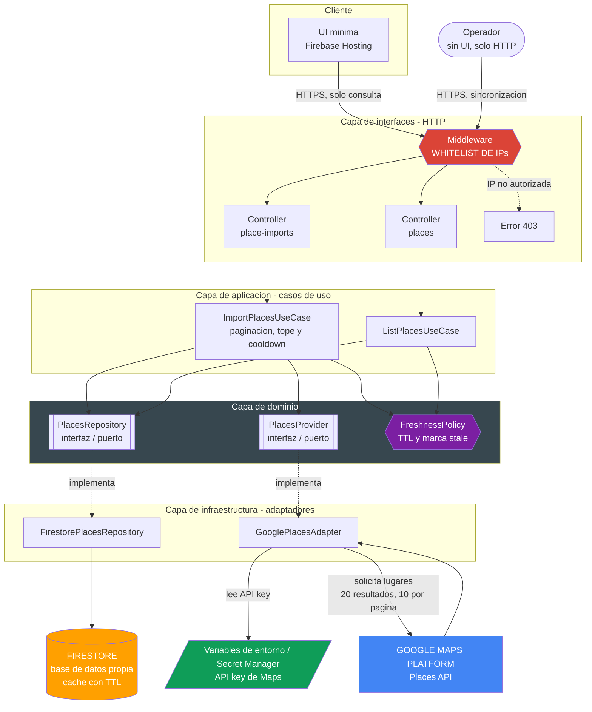

# Medical Specialists Directory

Proyecto académico del curso CC3106 Responsible AI de la Universidad del Valle de Guatemala. Construye un directorio de médicos especialistas de Ciudad de Guatemala para el Ministerio de Educación, sobre Firebase y Google Cloud Platform. Expone una API REST con dos endpoints: uno de sincronización contra Google Places y otro de consulta sobre la base propia.

## Documentación

| Documento                                              | Contenido                                                                                 |
| :----------------------------------------------------- | :---------------------------------------------------------------------------------------- |
| [docs/statement.md](docs/statement.md)                 | Enunciado del curso y desviaciones asumidas por el equipo                                 |
| [docs/design.md](docs/design.md)                       | Diseño del sistema: requisitos, arquitectura, contratos, modelo de datos y postura ética  |
| [docs/activities.md](docs/activities.md)               | Reparto de trabajo por persona y cronograma por semana                                    |
| [docs/development-setup.md](docs/development-setup.md) | Entorno de desarrollo: puesta en marcha, estructura, configuración y pruebas              |
| [docs/credentials-setup.md](docs/credentials-setup.md) | Cuentas, crédito de Google Cloud, API key, Firebase y secretos del despliegue             |
| [docs/runbook.md](docs/runbook.md)                     | Secuencia de comandos de cero a desplegado, con los errores frecuentes y su causa         |
| [docs/standards/](docs/standards/README.md)            | Estándares del equipo: arquitectura, API, código, Git, seguridad, pruebas y documentación |

## Puesta en marcha

```bash
cp .env.example .env
pnpm install
pnpm run --filter @msd/contracts build
pnpm dev
```

La UI queda en `http://localhost:5173` y la API en `http://localhost:4000/api/v1`. Con los valores por defecto no se requiere cuenta de Google ni de Firebase: el backend arranca con datos de ejemplo en memoria y un proveedor simulado. Con Docker, el equivalente es `docker compose up --build`. El detalle está en [docs/development-setup.md](docs/development-setup.md).

## Stack

TypeScript, Firebase Cloud Functions v2, Firestore, Firebase Hosting, Google Maps Platform Places API. Desarrollo local con el emulador de Firebase. Gestor de paquetes pnpm.

## Arquitectura



La UI solo conoce el endpoint de consulta. La sincronización no se expone en la interfaz porque cada invocación tiene costo real contra Places API.

## Endpoints

| Método y ruta                | Propósito                                                            | Llama a Google |
| :--------------------------- | :------------------------------------------------------------------- | :------------- |
| `POST /api/v1/place-imports` | Sincroniza hasta 20 resultados desde Places API hacia Firestore      | Sí             |
| `GET /api/v1/places`         | Consulta paginada del directorio con filtros por especialidad y zona | No             |
