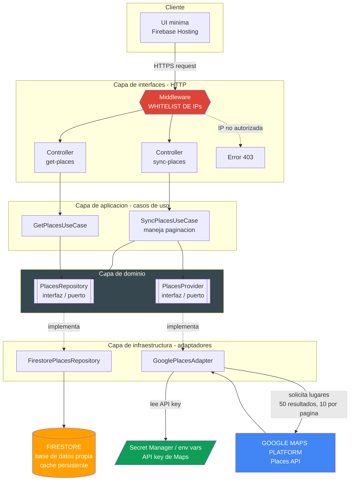

# Medical Specialists Directory

Academic project that provides a medical specialists directory using Firebase and Google Cloud Platform (GCP). It exposes a REST API with two endpoints to help locate healthcare professionals in underserved areas.

