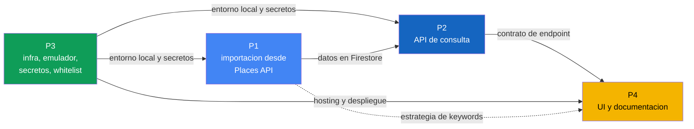

# Plan de actividades por persona

Reparto de trabajo del equipo de 4 personas para el proyecto. El diseño técnico de referencia está en [design.md](design.md); toda tarea de este documento se implementa según los contratos y capas definidos ahí.

## Resumen de roles

| # | Rol | Responsabilidad | Capa del sistema |
| :--- | :--- | :--- | :--- |
| P1 | Backend, recolección de datos | Google Places y persistencia | `GooglePlacesAdapter`, `FirestorePlacesRepository`, `ImportPlacesUseCase` |
| P2 | Backend, API de consulta | Directorio y paginación | `ListPlacesUseCase`, controller de `places` |
| P3 | Seguridad e infraestructura | Middleware y despliegue | Middleware de whitelist, secretos, Hosting, emulador |
| P4 | Frontend y documentación | UI y entregables escritos | UI mínima y documentación del proyecto |

## Dependencias entre personas

Camino crítico: P3 habilita el entorno, P1 llena la base, P2 expone la consulta y P4 la consume. P2 y P4 no deben esperar a que P1 termine: se desbloquean con datos de prueba cargados a mano en el emulador y con el contrato de API ya definido en [design.md](design.md).

## Cronograma por semana

| Semana | P1 | P2 | P3 | P4 |
| :--- | :--- | :--- | :--- | :--- |
| 1 | Cuenta GCP, key propia, primera llamada manual a Places API | Esqueleto del endpoint con datos simulados | Proyecto Firebase, emulador y variables de entorno | Maqueta de la UI y borrador de arquitectura |
| 2 | Adaptador con paginación y `upsert` por `placeId` | Consulta a Firestore, filtros y paginación | Middleware de whitelist y Secret Manager | UI conectada al endpoint contra el emulador |
| 3 | Manejo de errores, cuotas y corrida real de importación | Validaciones, códigos de error y respuestas finales | Hosting, despliegue y CI opcional | Estados de carga y error, estrategia de keywords |
| 4 | Verificación de datos y soporte a integración | Ajustes de integración | Despliegue final y revisión | Postura ética, documentación final y presentación |

## P1. Backend, recolección de datos

Responsable de que la base propia se llene con información real de Google Places, sin duplicados y con todos los campos requeridos.

Entregables:

- `GooglePlacesAdapter` funcionando contra Places API.
- `FirestorePlacesRepository` con escritura idempotente.
- `ImportPlacesUseCase` con la paginación completa.
- Controller de `POST /api/v1/place-imports`.

| ID | Tarea | Criterio de aceptación |
| :--- | :--- | :--- |
| P1-01 | Habilitar Places API en GCP con key propia | La key nunca se versiona; se consume desde variable de entorno |
| P1-02 | Implementar `GooglePlacesAdapter` que traduzca la respuesta de Google a la entidad `Place` | El caso de uso no conoce el formato de Google |
| P1-03 | Diseñar la búsqueda por especialidad más zona | Una misma consulta produce resultados reproducibles |
| P1-04 | Implementar la paginación por páginas de 10 hasta el tope acordado | El recorrido corta al alcanzar el tope o al no haber `nextPageToken` |
| P1-05 | Persistir con `placeId` como identificador del documento | Repetir la importación no crea documentos duplicados |
| P1-06 | Guardar los campos definidos en el modelo de datos | Todo documento tiene `name`, `specialty`, `zone`, `formattedAddress`, coordenadas, `createdAt` y `updatedAt` |
| P1-07 | Implementar `ImportPlacesUseCase` con el resumen de importación | Devuelve `pagesFetched`, `itemsFetched` e `itemsUpserted` |
| P1-08 | Manejar errores y cuotas de Places API | Un fallo del proveedor responde `503` con `places_provider_unavailable`, sin exponer la key ni trazas |
| P1-09 | Definir los índices de Firestore que requiere la consulta de P2 | Los filtros de P2 corren sin error de índice faltante |

Coordinación: entrega a P2 la forma exacta de los documentos en Firestore y a P4 el criterio con que se eligieron las keywords de búsqueda.

## P2. Backend, API de consulta

Responsable del endpoint que consume el Ministerio de Salud. Lee únicamente de la base propia; nunca llama a Google.

Entregables:

- `ListPlacesUseCase` con filtros y paginación.
- Controller de `GET /api/v1/places`.
- Manejo de errores conforme al formato de respuesta del proyecto.

| ID | Tarea | Criterio de aceptación |
| :--- | :--- | :--- |
| P2-01 | Crear el controller del directorio | Solo traduce HTTP a llamada del caso de uso; no contiene reglas de negocio |
| P2-02 | Implementar paginación con `page` y `pageSize` | La respuesta incluye `meta.pagination` con `page`, `pageSize`, `totalItems` y `totalPages` |
| P2-03 | Validar los límites de `pageSize` | Un valor fuera de rango responde `400` con `validation_error` |
| P2-04 | Implementar filtros por especialidad y zona | Los filtros se combinan y se resuelven en la consulta a Firestore, no en memoria |
| P2-05 | Implementar `ListPlacesUseCase` sobre el puerto `PlacesRepository` | El caso de uso no importa el SDK de Firestore |
| P2-06 | Devolver solo los campos que la UI necesita | La respuesta no expone el documento completo ni campos internos |
| P2-07 | Implementar el catálogo de especialidades soportadas | Una especialidad no soportada responde `422` con `unsupported_specialty` |
| P2-08 | Documentar el endpoint en OpenAPI | El contrato publicado coincide con la implementación |

Coordinación: congela el contrato con P4 en la semana 1 para que la UI avance en paralelo, y confirma con P1 los índices necesarios.

## P3. Seguridad e infraestructura

Responsable de que el servicio solo sea consumible por quien debe, de que los secretos no se filtren y de que el equipo tenga un entorno donde trabajar.

Entregables:

- Middleware de whitelist de IPs.
- Gestión de secretos y variables de entorno.
- Emulador local documentado, Hosting y despliegue.

| ID | Tarea | Criterio de aceptación |
| :--- | :--- | :--- |
| P3-01 | Implementar el middleware de whitelist | Se ejecuta antes de cualquier controller; una IP no autorizada recibe `403` con `ip_not_allowed` |
| P3-02 | Leer correctamente la IP de origen detrás del proxy de Firebase | La IP evaluada es la pública real del cliente, no la del proxy |
| P3-03 | Administrar la whitelist como configuración | Agregar o quitar una IP no requiere cambiar lógica de negocio |
| P3-04 | Configurar Secret Manager y variables de entorno | Ninguna key aparece en el repositorio ni en logs |
| P3-05 | Configurar el emulador de Functions, Firestore y Hosting | Cualquier integrante levanta el entorno con un comando documentado |
| P3-06 | Configurar Firebase Hosting para la UI | La UI publicada consume la API por HTTPS |
| P3-07 | Configurar CI, opcional | El pipeline corre lint y pruebas en cada Pull Request |
| P3-08 | Ejecutar y revisar el despliegue final | Los dos endpoints responden en el proyecto desplegado |
| P3-09 | Apoyar la integración entre las cuatro partes | Los bloqueos de entorno se resuelven sin detener a los demás |

Coordinación: es la primera persona en entregar, porque P1, P2 y P4 dependen del entorno local y de los secretos.

## P4. Frontend y documentación

Responsable de la interfaz mínima y de los entregables escritos, que tienen peso propio en la evaluación.

Entregables:

- UI mínima desplegada en Firebase Hosting.
- Documentación de arquitectura, estrategia de keywords y postura ética.
- Presentación final.

| ID | Tarea | Criterio de aceptación |
| :--- | :--- | :--- |
| P4-01 | Implementar la interfaz mínima | Sin frameworks pesados ni trabajo visual innecesario; el foco es que funcione |
| P4-02 | Campo de búsqueda por especialidad y zona | Los filtros se traducen a query params del endpoint |
| P4-03 | Tabla de resultados | Muestra nombre, dirección, especialidad y zona |
| P4-04 | Consumir la API de P2 | La UI solo conoce el endpoint de consulta; nunca llama a Google ni a Firestore |
| P4-05 | Mostrar la paginación | Los controles se construyen a partir de `meta.pagination` |
| P4-06 | Manejar estados de carga y error | Un `403`, un `400` y una lista vacía se distinguen visualmente |
| P4-07 | Documentar la arquitectura | El documento explica las capas y por qué la UI no toca Google directamente |
| P4-08 | Redactar la estrategia de keywords | Explica qué términos se buscaron, por qué y qué cobertura dejan fuera |
| P4-09 | Redactar la postura ética | Cubre términos de servicio de Google, minimización de datos y cobertura desigual por zona |
| P4-10 | Preparar la presentación | Recorre el problema, la arquitectura, la demo y las decisiones discutidas |

Coordinación: trabaja contra el contrato congelado en la semana 1 y usa datos de prueba en el emulador mientras P1 termina la importación.

## Convenciones compartidas

- Una rama por tarea, con Pull Request revisado por al menos otra persona del equipo.
- Ninguna key ni archivo `.env` entra al repositorio.
- Todo cambio de contrato de API se acuerda antes de implementarse y se refleja en [design.md](design.md).
- Cada integrante usa su propia API key de Google en desarrollo.
- La lógica de negocio vive en los casos de uso, nunca en controllers ni en adaptadores.

## Definición de hecho

Una tarea se considera terminada cuando cumple todo lo siguiente:

- Funciona contra el emulador local.
- Tiene su Pull Request aprobado y fusionado.
- No introduce secretos ni datos sensibles en el repositorio.
- Está reflejada en la documentación cuando cambia el comportamiento observable del sistema.

## Puntos por confirmar con el equipo

Tres detalles del reparto original no coinciden con [design.md](design.md) y hay que fijar cuál versión rige antes de implementar:

| Punto | Reparto original | design.md |
| :--- | :--- | :--- |
| Tope de resultados por importación | 20 | 50, en páginas de 10 |
| Ruta del endpoint de consulta | `GET /directorio` | `GET /api/v1/places` |
| Límite de `pageSize` en la consulta | Máximo 50 | Por defecto 10 |

Este documento asume los valores de [design.md](design.md). Si el enunciado del curso fija otros, se actualizan ambos archivos a la vez.
