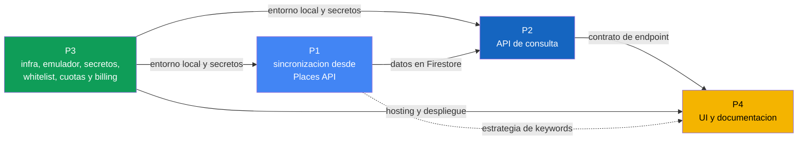

# Plan de actividades por persona

Reparto de trabajo del equipo de 4 personas para el proyecto. El enunciado del curso está en [statement.md](statement.md) y el diseño técnico de referencia en [design.md](design.md); toda tarea de este documento se implementa según los contratos y capas definidos ahí.

## Resumen de roles

| #   | Rol                           | Responsabilidad                 | Capa del sistema                                                          |
| :-- | :---------------------------- | :------------------------------ | :------------------------------------------------------------------------ |
| P1  | Backend, recolección de datos | Google Places y persistencia    | `GooglePlacesAdapter`, `FirestorePlacesRepository`, `ImportPlacesUseCase` |
| P2  | Backend, API de consulta      | Directorio y paginación         | `ListPlacesUseCase`, `FreshnessPolicy`, controller de `places`            |
| P3  | Seguridad e infraestructura   | Middleware, costos y despliegue | Middleware de whitelist, secretos, cuotas, Hosting, emulador              |
| P4  | Frontend y documentación      | UI y entregables escritos       | UI mínima y documentación del proyecto                                    |

## Dependencias entre personas



Camino crítico: P3 habilita el entorno, P1 llena la base, P2 expone la consulta y P4 la consume. P2 y P4 no deben esperar a que P1 termine: se desbloquean con datos de prueba cargados a mano en el emulador y con el contrato de API ya definido en [design.md](design.md).

## Cronograma por semana

El cronograma se alinea con los entregables del enunciado. Dos hitos son innegociables por semana: la whitelist debe estar funcionando en la Semana 1 y la estrategia de keywords debe estar documentada en la Semana 2, antes de cualquier búsqueda masiva.

| Semana | Entregable del curso                                                                                     | P1                                                                      | P2                                                                     | P3                                                                                                            | P4                                                                         |
| :----- | :------------------------------------------------------------------------------------------------------- | :---------------------------------------------------------------------- | :--------------------------------------------------------------------- | :------------------------------------------------------------------------------------------------------------ | :------------------------------------------------------------------------- |
| 1      | Proyecto configurado, alertas de billing con screenshot, `hello world` desplegado, whitelist funcionando | Cuenta GCP, key propia restringida, primera llamada manual a Places API | Esqueleto del endpoint con datos simulados y contrato congelado        | Proyecto Firebase, emulador, variables de entorno, **whitelist operativa**, alertas de billing y cuota diaria | Maqueta de la UI y borrador del diagrama de arquitectura                   |
| 2      | Función de recolección operativa, **estrategia de keywords documentada**, Firestore con datos reales     | Adaptador con paginación, tope de 20 y `upsert` por `placeId`           | Consulta a Firestore, filtros, paginación y `FreshnessPolicy`          | Secret Manager en despliegue y revisión de consumo real                                                       | Redacción de la estrategia de keywords junto con P1, UI contra el emulador |
| 3      | API paginada funcional, UI accesible en Hosting                                                          | Manejo de errores, cuotas y corrida real de sincronización              | Validaciones, códigos de error, `429` de cooldown y respuestas finales | Hosting, despliegue y CI opcional                                                                             | Estados de carga y error, UI desplegada                                    |
| 4      | Documentación técnica de máximo 5 páginas, diagrama, postura ética, presentación                         | Verificación de datos y reporte de cobertura por campo                  | Ajustes de integración                                                 | Despliegue final y revisión de seguridad                                                                      | Resumen técnico de 5 páginas, postura ética y presentación                 |

## P1. Backend, recolección de datos

Responsable de que la base propia se llene con información real de Google Places, sin duplicados y con todos los campos requeridos.

Entregables:

- `GooglePlacesAdapter` funcionando contra Places API.
- `FirestorePlacesRepository` con escritura idempotente.
- `ImportPlacesUseCase` con paginación, tope y cooldown.
- Controller de `POST /api/v1/place-imports`.

| ID    | Tarea                                                                                      | Criterio de aceptación                                                                                                                                                                       |
| :---- | :----------------------------------------------------------------------------------------- | :------------------------------------------------------------------------------------------------------------------------------------------------------------------------------------------- |
| P1-01 | Habilitar Places API en GCP con key propia y restringirla por IP                           | La key nunca se versiona, se consume desde variable de entorno y solo funciona desde las IPs del proyecto                                                                                    |
| P1-02 | Implementar `GooglePlacesAdapter` que traduzca la respuesta de Google a la entidad `Place` | El caso de uso no conoce el formato de Google                                                                                                                                                |
| P1-03 | Diseñar la estrategia de keywords junto con P4                                             | Documentada antes de ejecutar cualquier búsqueda masiva; una misma keyword produce resultados reproducibles; cada variante se justifica contra nombres comerciales reales                    |
| P1-04 | Implementar la paginación por páginas de 10 con tope de 20 resultados                      | El recorrido corta al alcanzar 20 registros o al no haber `nextPageToken`; máximo 2 llamadas facturables                                                                                     |
| P1-13 | Aplicar `includedType` con `strictTypeFiltering`, `languageCode` y `regionCode`            | Los resultados excluyen farmacias, tiendas y negocios no médicos; vienen en español y sesgados a Guatemala                                                                                   |
| P1-14 | Limitar el field mask a los campos que se persisten                                        | No se solicita `places.rating` ni ningún campo que no se guarde; cada campo pedido está justificado                                                                                          |
| P1-05 | Persistir con `placeId` como identificador del documento                                   | Repetir la sincronización no crea documentos duplicados                                                                                                                                      |
| P1-06 | Guardar los campos definidos en el modelo de datos                                         | Todo documento tiene `name`, `specialty`, `formattedAddress`, `zone`, `sourceKeyword`, `collectedAt` y `createdAt`; `phoneNumber` y `website` se guardan vacíos cuando Google no los entrega |
| P1-07 | Tomar `zone` y `specialty` de la keyword, nunca de la dirección                            | Ningún campo se infiere ni se completa por cuenta del sistema                                                                                                                                |
| P1-08 | Implementar `ImportPlacesUseCase` con el resumen de sincronización                         | Devuelve `pagesFetched`, `itemsFetched` e `itemsUpserted`                                                                                                                                    |
| P1-09 | Implementar el cooldown por keyword y zona                                                 | Una sincronización repetida antes del cooldown responde `429` con `place_import_cooldown_active`                                                                                             |
| P1-10 | Aplicar escritura solo ante respuesta exitosa de Google                                    | Un fallo del proveedor no borra ni degrada lo ya almacenado; responde `503` con `places_provider_unavailable`                                                                                |
| P1-11 | Definir los índices de Firestore que requiere la consulta de P2                            | Los filtros de P2 y la detección de vencidos corren sin error de índice faltante                                                                                                             |
| P1-12 | Reportar la cobertura real por campo tras la corrida real                                  | Se conoce el porcentaje de registros sin `phoneNumber` y sin `website`                                                                                                                       |

Coordinación: entrega a P2 la forma exacta de los documentos en Firestore y a P4 el criterio con que se eligieron las keywords.

### Traspaso pendiente a P1

P3 dejó estos puntos resueltos o preparados durante la Semana 2. Requieren decisión o continuación de P1.

| Punto                                                                                                                                                                                                                                                                                                                                                                                                                                                                                                                                                                                                                                                                                                                                                                                                                                                                                              | Estado                                                                                                                                                                                        |
| :------------------------------------------------------------------------------------------------------------------------------------------------------------------------------------------------------------------------------------------------------------------------------------------------------------------------------------------------------------------------------------------------------------------------------------------------------------------------------------------------------------------------------------------------------------------------------------------------------------------------------------------------------------------------------------------------------------------------------------------------------------------------------------------------------------------------------------------------------------------------------------------------- | :-------------------------------------------------------------------------------------------------------------------------------------------------------------------------------------------- |
| Las verificaciones de P1-03 se ejecutaron y **el agentivo se recuperó**: aporta un 15% de registros exclusivos y son consultorios registrados con el nombre del médico. El eje de diacríticos se eliminó. Detalle en [design.md](design.md#verificaciones-previas)                                                                                                                                                                                                                                                                                                                                                                                                                                                                                                                                                                                                                                 | Hecho                                                                                                                                                                                         |
| `SPECIALTY_KEYWORD_VARIANTS` incluye el agentivo en nueve especialidades                                                                                                                                                                                                                                                                                                                                                                                                                                                                                                                                                                                                                                                                                                                                                                                                                           | **Comprobado en las diez**, pero `medico general` se descartó **por precisión**: aportaba once exclusivos y eran un coloproctólogo, una clínica de dermatología y un centro de quiroprácticos |
| El experimento es reproducible con `apps/backend/scripts/compareKeywords.mjs`, que acepta `--page-size` y no llama a Google sin `--run`                                                                                                                                                                                                                                                                                                                                                                                                                                                                                                                                                                                                                                                                                                                                                            | Disponible                                                                                                                                                                                    |
| P1-11, índices de Firestore: los cuatro de `places` estaban declarados, faltaba el de `importRuns` que exige el cooldown. Agregado y desplegado                                                                                                                                                                                                                                                                                                                                                                                                                                                                                                                                                                                                                                                                                                                                                    | Hecho                                                                                                                                                                                         |
| P1-12, cobertura por campo: medida sobre la base completa tras corregir los defectos. 90% de teléfono, 66% de zona, 50% de sitio web, y de esos 36 son perfiles de red social                                                                                                                                                                                                                                                                                                                                                                                                                                                                                                                                                                                                                                                                                                                      | Hecho                                                                                                                                                                                         |
| La medición anterior por especialidad en zona 10 quedó obsoleta: se hizo sobre datos recolectados con el cooldown y la zona defectuosos, de modo que solo corría una variante de cada cuatro y la zona era la de la última consulta que tocó el registro                                                                                                                                                                                                                                                                                                                                                                                                                                                                                                                                                                                                                                           | **Rehacer** si se quiere el desglose por especialidad                                                                                                                                         |
| Se corrieron las diez especialidades sobre zona 10 real: 168 `itemsUpserted` mas solo 159 documentos distintos en Firestore. La causa es que `placeId` es la clave del documento y el mismo negocio real puede coincidir con la búsqueda de más de una especialidad, así que la sincronización más reciente le pisa la etiqueta a la anterior. Se agregó `specialtyConflicts` al resumen de `POST /api/v1/place-imports` para que quede visible en el momento. **P1 decidió: se documenta como limitación conocida, no se guarda un arreglo de especialidades por lugar** — Google no dice cuál de las coincidentes es "la" correcta, así que guardar varias sin ese criterio traslada el problema en vez de resolverlo, y el cambio de modelo no se justifica para el alcance del curso. Declarado en la postura ética y en la tabla de decisiones de [design.md](design.md#decisiones-de-diseño) | Hecho                                                                                                                                                                                         |

Lo que queda para P1, ya no como decisión sino como trabajo con datos a la vista:

**Ortopedia conserva ambas formas.** `ortopedia` devuelve 8 resultados frente a los 20 de `ortopedista`, pero 2 de esos 8 son exclusivos suyos, de modo que sigue aportando. Su bajo rendimiento no la invalida mientras encuentre registros propios.

**Medicina general pierde la forma agentiva.** `medico general` aportaba once exclusivos, más que ninguna otra variante, pero eran un coloproctólogo, una clínica de dermatología, un centro de quiroprácticos. Se descartó **por precisión, no por cantidad**: guardar un dermatólogo bajo `generalMedicine` no amplía la cobertura, la corrompe.

**El experimento mide cobertura, no precisión.** Una variante que trae cinco registros nuevos y equivocados puntúa igual que una que trae cinco correctos. Por eso el script imprime los nombres de los exclusivos y no solo el conteo: la segunda mitad de la decisión es leerlos. La limitación está declarada en [design.md](design.md#qué-mide-este-experimento-y-qué-no).

**El presupuesto de la corrida completa está aprobado**: 18.90 USD para 770 sincronizaciones. Falta el script que la ejecute, y tiene dos condiciones que no son opcionales. Debe **respetar la cuota por minuto**, que está en 60 solicitudes y a dos llamadas por sincronización permite 30 por minuto; superarla devuelve `429`. Y antes de correrla hay que **subir la cuota diaria de 200 a 2,000 y volver a bajarla al terminar**, porque con 200 al día la campaña tardaría ocho días. El detalle está en [design.md](design.md#presupuesto-aprobado-para-la-corrida-completa).

Dos cosas útiles para P1-12, el reporte de cobertura. La coincidencia de Google **no es léxica sino semántica**: `Dr. Fernando Muralles - Cardiología Pediátrica` responde a `cardiologo` y no a `cardiologia`, pese a lo que dice su nombre, así que razonar sobre el rótulo no predice qué devuelve la API. Y varias consultas devuelven establecimientos de otra especialidad, hospitales generales e incluso un edificio de consultorios, de modo que el reporte de cobertura debería distinguir entre registros recolectados y registros que efectivamente ejercen la especialidad bajo la que se guardaron.

## P2. Backend, API de consulta

Responsable del endpoint que consume el Ministerio. Lee únicamente de la base propia; nunca llama a Google.

Entregables:

- `ListPlacesUseCase` con filtros y paginación.
- `FreshnessPolicy` en la capa de dominio.
- Controller de `GET /api/v1/places`.
- Manejo de errores conforme al formato de respuesta del proyecto.

| ID    | Tarea                                                              | Criterio de aceptación                                                                               |
| :---- | :----------------------------------------------------------------- | :--------------------------------------------------------------------------------------------------- |
| P2-01 | Crear el controller del directorio                                 | Solo traduce HTTP a llamada del caso de uso; no contiene reglas de negocio                           |
| P2-02 | Implementar paginación con `page` y `pageSize`                     | La respuesta incluye `meta.pagination` con `page`, `pageSize`, `totalItems` y `totalPages`           |
| P2-03 | Validar los límites de `pageSize`                                  | Un `pageSize` mayor a 50 responde `400` con `validation_error`                                       |
| P2-04 | Implementar filtros por especialidad y zona                        | Los filtros se combinan y se resuelven en la consulta a Firestore, no en memoria                     |
| P2-05 | Implementar `ListPlacesUseCase` sobre el puerto `PlacesRepository` | El caso de uso no importa el SDK de Firestore                                                        |
| P2-06 | Implementar `FreshnessPolicy` como estrategia de dominio           | El TTL vive en una constante configurable por entorno; cambiarlo no toca casos de uso ni adaptadores |
| P2-07 | Exponer `freshness` y `collectedAt` en cada registro               | Un registro vencido se devuelve marcado como `stale`, nunca omitido ni convertido en lista vacía     |
| P2-08 | Devolver solo los campos que la UI necesita                        | La respuesta no expone el documento completo ni campos internos                                      |
| P2-09 | Implementar el catálogo de especialidades soportadas               | Una especialidad fuera del catálogo responde `422` con `specialty_not_supported`                     |
| P2-10 | Documentar el endpoint en OpenAPI                                  | El contrato publicado coincide con la implementación                                                 |
| P2-11 | Devolver siempre `code` y `message` con audiencias separadas       | El `message` nunca se muestra al usuario; ningún texto de cara al usuario se arma en el backend      |

Coordinación: congela el contrato con P4 en la semana 1 para que la UI avance en paralelo, y confirma con P1 los índices necesarios.

### Traspaso pendiente a P2

Tres cambios sobre la capa de consulta salieron de ejecutar el sistema contra Firestore real. Los tres están aplicados; el segundo y el tercero conviene que P2 los conozca porque afectan a decisiones suyas.

**El filtro `q` de texto libre se retiró del contrato.** No lo pedía el enunciado y contradecía el catálogo cerrado que el propio diseño declara. Además no podía implementarse igual en los dos adaptadores: el de memoria resolvía subcadena y el de Firestore prefijo, y el rango de este último estaba mal formado (`>= prefijo AND < prefijo` es vacío), de modo que nunca devolvía resultados. Dos implementaciones del mismo puerto con conjuntos distintos rompen la propiedad que justifica la arquitectura. El razonamiento completo está en [design.md](design.md#por-qué-no-hay-búsqueda-por-texto).

**La purga de `FreshnessPolicy` no funcionaba en producción.** El adaptador de Firestore filtraba por `updatedAt`, campo que la entidad no tiene, y Firestore excluye de las consultas de rango los documentos que carecen del campo consultado: devolvía cero sin error. El adaptador en memoria sí filtraba por `collectedAt`, así que en desarrollo funcionaba. Corregido, y con prueba de regresión.

**El adaptador de Firestore ya tiene pruebas de integración** contra el emulador, en `apps/backend/tests/integration/`. Cubren los cuatro métodos del puerto, incluida la paginación y el orden que P2-02 y P2-04 definen. Se ejecutan con `pnpm run --filter @msd/backend test:integration` y en CI.

**Decisión de P2, Semana 3: el filtro de texto no vuelve.** No queda tiempo dentro del curso para hacerlo bien, y hacerlo mal es peor que no hacerlo: un campo de búsqueda que devuelve poco parece un directorio incompleto, no una limitación técnica. El requisito de filtrado lo cubren la especialidad y la zona, que es lo que el enunciado enumera. La vía correcta, si alguien retomara el proyecto, queda escrita en [design.md](design.md#por-qué-no-hay-búsqueda-por-texto): declararlo como búsqueda por prefijo en el contrato y alinear ambos adaptadores, asumiendo de forma explícita que con nombres médicos el término distintivo casi nunca va primero.

## P3. Seguridad e infraestructura

Responsable de que el servicio solo sea consumible por quien debe, de que los secretos no se filtren, de que el gasto esté acotado y de que el equipo tenga un entorno donde trabajar.

Entregables:

- Middleware de whitelist de IPs operativo en la Semana 1.
- Alertas de billing y cuota diaria configuradas, con capturas en `docs/images/`.
- Gestión de secretos y variables de entorno.
- Emulador local documentado, Hosting y despliegue.

| ID    | Tarea                                                               | Criterio de aceptación                                                                                                               |
| :---- | :------------------------------------------------------------------ | :----------------------------------------------------------------------------------------------------------------------------------- |
| P3-01 | Implementar el middleware de whitelist                              | Se ejecuta antes de cualquier controller; una IP no autorizada recibe `403` con `ip_not_allowed` sin ejecutar nada más               |
| P3-02 | Leer correctamente la IP de origen detrás del proxy de Firebase     | La IP evaluada es la pública real del cliente, no la del proxy                                                                       |
| P3-03 | Administrar la whitelist como configuración editable sin redeploy   | El middleware lee la lista desde un documento de Firestore; agregar o quitar una IP no requiere cambiar código ni volver a desplegar |
| P3-04 | Configurar alertas de billing al 50% y al 90%                       | Capturas entregadas en `docs/images/` y enlazadas desde `design.md`                                                                  |
| P3-05 | Establecer cuota máxima de llamadas por día en la consola de APIs   | El valor queda documentado y no permite acercarse al crédito mensual                                                                 |
| P3-06 | Configurar variables de entorno y Secret Manager para el despliegue | Ninguna key aparece en el repositorio ni en logs                                                                                     |
| P3-07 | Configurar el emulador de Functions, Firestore y Hosting            | Cualquier integrante levanta el entorno con un comando documentado; cubre el 90% del desarrollo                                      |
| P3-08 | Desplegar la función `hello world` en la Semana 1                   | Responde en el proyecto desplegado y sirve de verificación del pipeline                                                              |
| P3-09 | Configurar Firebase Hosting para la UI                              | La UI publicada consume la API por HTTPS                                                                                             |
| P3-10 | Evaluar Cloud Armor como alternativa al middleware                  | Decisión documentada, con la diferencia frente al middleware; no es requerido para nota completa                                     |
| P3-11 | Configurar CI, opcional                                             | El pipeline corre lint y pruebas en cada Pull Request                                                                                |
| P3-12 | Ejecutar y revisar el despliegue final                              | Los dos endpoints responden en el proyecto desplegado                                                                                |

Coordinación: es la primera persona en entregar, porque P1, P2 y P4 dependen del entorno local y de los secretos, y porque la Semana 1 se evalúa casi por completo sobre su trabajo.

### Estado del despliegue (Semana 3)

P3-03, P3-06, P3-08, P3-09 y P3-12 quedaron ejecutados de punta a punta: `helloWorld` y `api` desplegados como Cloud Functions, secreto `GOOGLE_MAPS_API_KEY` en Secret Manager con acceso concedido por IAM a la cuenta de la función, whitelist en el documento `config/ipWhitelist` y UI publicada en Hosting consumiendo la API por HTTPS. Evidencia en [design.md](design.md#evidencia-de-despliegue).

El despliegue se hizo dos veces y en proyectos distintos, cosa que conviene explicar porque no fue un descuido.

**El primero, en el proyecto de P1**, sirvió para encontrar dos fallos que ninguna prueba local podía revelar, porque en desarrollo no existe el salto de Hosting ni un origen de navegador distinto del propio backend: la URL de la API horneada en el bundle del frontend (`VITE_API_BASE_URL` debía ser relativa) y `TRUST_PROXY_HOPS` corto para los saltos que agrega Hosting. Ambos corregidos y documentados. Sus datos, sin embargo, son de antes de arreglar la resolución de zona y el cooldown: 19 registros.

**El segundo, en el proyecto de P3** (`bamboo-mercury-504617-g5`), es el que queda como demo, porque es el único que corre sobre la campaña completa y corregida de la Semana 2. Demo: [https://bamboo-mercury-504617-g5.web.app](https://bamboo-mercury-504617-g5.web.app).

Que el despliegue se reprodujera en un proyecto limpio siguiendo solo el runbook es, de paso, la comprobación de que ese documento sirve: los dos únicos huecos que aparecieron fueron el recorrido de consola hasta Secret Manager y la estructura del documento de whitelist, ya incorporados.

Pendiente: agregar a la whitelist las direcciones de P1, P2 y P4 y la del aula antes de la demo en vivo; decisión documentada sobre Cloud Armor (P3-10); tag de versión semanal.

## P4. Frontend y documentación

Responsable de la interfaz mínima y de los entregables escritos, que suman 40% de la evaluación entre documentación y presentación.

Entregables:

- UI mínima desplegada en Firebase Hosting.
- Resumen técnico de máximo 5 páginas, diagrama de arquitectura, estrategia de keywords y postura ética.
- Presentación final de 20 minutos con demo en vivo.

| ID    | Tarea                                                  | Criterio de aceptación                                                                                                                  |
| :---- | :----------------------------------------------------- | :-------------------------------------------------------------------------------------------------------------------------------------- |
| P4-01 | Implementar la interfaz mínima                         | Sin frameworks pesados ni trabajo visual innecesario; el foco es que funcione                                                           |
| P4-02 | Campo de búsqueda por especialidad y zona              | Los filtros se traducen a query params del endpoint                                                                                     |
| P4-03 | Tabla de resultados                                    | Muestra nombre, especialidad, dirección, zona, teléfono y sitio web                                                                     |
| P4-04 | Consumir únicamente la API de consulta                 | La UI nunca llama a Google ni a Firestore, y no expone control alguno de sincronización                                                 |
| P4-05 | Mostrar la paginación                                  | Los controles se construyen a partir de `meta.pagination`                                                                               |
| P4-06 | Mostrar la marca de frescura y la fecha de recolección | Un registro `stale` se distingue visualmente y muestra su `collectedAt`                                                                 |
| P4-07 | Distinguir campos vacíos de errores                    | Un `website` vacío se muestra como ausente, no como fallo del sistema                                                                   |
| P4-08 | Manejar estados de carga y error                       | Un `403`, un `400` y una lista vacía se distinguen visualmente                                                                          |
| P4-13 | Crear los diccionarios `src/i18n/es.json` y `en.json`  | Contienen todas las claves del catálogo de códigos; el mensaje mostrado sale del diccionario, nunca del campo `message` de la respuesta |
| P4-09 | Redactar la estrategia de keywords junto con P1        | Explica qué términos se buscaron, por qué y qué cobertura dejan fuera; lista para la Semana 2                                           |
| P4-10 | Producir el resumen técnico de máximo 5 páginas        | Condensa `design.md` sin contradecirlo; incluye el diagrama de arquitectura                                                             |
| P4-11 | Redactar la postura ética                              | Cubre términos de servicio de Google, no inferir datos, minimización, cobertura desigual y fecha de recolección                         |
| P4-12 | Preparar la presentación de 20 minutos                 | Recorre el problema, la arquitectura, la demo en vivo y las decisiones discutidas                                                       |

Coordinación: trabaja contra el contrato congelado en la semana 1 y usa datos de prueba en el emulador mientras P1 termina la sincronización.

### Traspaso pendiente a P4

Cuatro cambios sobre la interfaz salieron de usarla contra datos y despliegue reales. Están aplicados; conviene que P4 los conozca porque afectan a decisiones suyas.

**Un filtro que se vaciaba seguía aplicándose.** `usePlaces.search` fundía la consulta nueva con la anterior. Como el formulario omite la clave del filtro que está vacío en lugar de enviarla en blanco, la clave ausente dejaba viva la del envío previo: borrar la zona y pulsar Buscar seguía devolviendo la zona anterior, y **Limpiar** vaciaba el formulario sin cambiar los resultados. Corregido reemplazando la consulta entera, que es la semántica correcta: el formulario envía siempre su estado completo. Con prueba de regresión en `apps/frontend/tests/usePlaces.test.ts`, verificada contra el código defectuoso.

**El esqueleto de carga sustituía la tabla entera**, de modo que la cabecera y la barra de paginación desaparecían en cada búsqueda y parecía una recarga. Ahora solo cambia el cuerpo, con tantas filas como resultados se esperan según `pageSize`. El efecto lateral que se buscaba es que el contenedor deje de cambiar de altura al llegar los datos: ese salto provocaba scroll, y el scroll cierra los desplegables nativos, lo que explicaba que un selector abierto se cerrara solo.

**El aviso de cobertura se retiró de la interfaz** por decisión del equipo. La advertencia sigue en la documentación y en la postura ética, pero deja de estar donde el usuario final la ve.

**La UI desplegada no lee ningún archivo de entorno.** Los valores de `apps/frontend/src/config/env.ts` son a la vez el respaldo y la configuración de producción; cambiar uno cambia lo que se publica. El detalle está en [development-setup.md](development-setup.md#cómo-se-configura-el-sitio-desplegado).

## Estándares del equipo

Las reglas de trabajo están en [standards/](standards/README.md): arquitectura, contratos de API, códigos de error y traducción, estilo de código, flujo de Git, seguridad, pruebas y documentación. Se leen antes de escribir la primera línea de código.

## Convenciones compartidas

- Ninguna key ni archivo `.env` entra al repositorio.
- Todo cambio de contrato de API se acuerda antes de implementarse y se refleja en [design.md](design.md).
- Cada integrante usa su propia API key de Google en desarrollo y responde por el gasto de su cuenta.
- El desarrollo ocurre contra el emulador; cada deploy a producción tiene costo real.
- La lógica de negocio vive en los casos de uso, nunca en controllers ni en adaptadores.
- Ningún campo se infiere ni se rellena; los vacíos se documentan.

## Control de versiones

### Trabajo directo sobre `main`

El equipo trabaja sobre `main`, sin ramas por tarea ni Pull Requests. Es una desviación deliberada del estándar de branching del proyecto, adoptada por la restricción de tiempo de cuatro semanas y porque el enunciado no evalúa el flujo de Git.

La desviación es viable porque el reparto de responsabilidades separa los archivos: P1 trabaja sobre el adaptador de Places y el caso de uso de sincronización, P2 sobre el caso de uso de consulta y la política de frescura, P3 sobre middleware y configuración, y P4 sobre la UI. El solapamiento real se concentra en pocos archivos compartidos.

Reglas que sustituyen la protección que daba el Pull Request:

- Commits pequeños y frecuentes. Un commit que toca cuatro capas a la vez es un conflicto esperando ocurrir.
- `git pull --rebase` antes de cada `push`. Nadie hace `push` sobre una copia desactualizada.
- No se deja `main` roto. Antes de subir, el cambio corre contra el emulador local.
- Aviso al equipo antes de tocar archivos compartidos: contratos, tipos comunes, configuración y `.env.example`.
- Quien rompa `main` lo arregla o lo revierte de inmediato, antes de seguir con su tarea. Un `main` roto bloquea a las otras tres personas.

### Formato de commits

Conventional Commits, en español y sin punto final:

```bash
<tipo>[alcance opcional]: <descripcion breve en imperativo>

[body opcional]
```

| Tipo       | Cuándo usar                                    |
| :--------- | :--------------------------------------------- |
| `feat`     | Nueva funcionalidad                            |
| `fix`      | Corrección de un error existente               |
| `chore`    | Mantenimiento que no afecta producción         |
| `docs`     | Documentación, README, comentarios             |
| `style`    | Formato sin cambios de lógica                  |
| `refactor` | Cambio de estructura sin alterar funcionalidad |
| `test`     | Pruebas, fixtures o mocks                      |
| `ci`       | Pipelines y workflows                          |
| `build`    | Build, compilación o dependencias              |

Alcances del proyecto: `places`, `imports`, `whitelist`, `config`, `ui`, `docs`.

```bash
feat(imports): agrega paginacion con tope de 20 resultados
fix(whitelist): corrige lectura de IP detras del proxy
docs: actualiza estrategia de keywords
```

### Versionado

Un tag por entrega semanal, para dejar trazable qué existía en cada evaluación:

| Tag      | Corresponde a                                        |
| :------- | :--------------------------------------------------- |
| `v0.1.0` | Semana 1: infraestructura, whitelist y `hello world` |
| `v0.2.0` | Semana 2: recolección operativa y datos reales       |
| `v0.3.0` | Semana 3: API paginada y UI desplegada               |
| `v1.0.0` | Semana 4: entrega final                              |

## Definición de hecho

Una tarea se considera terminada cuando cumple todo lo siguiente:

- Funciona contra el emulador local.
- Está en `main` sin romper el trabajo de los demás.
- No introduce secretos ni datos sensibles en el repositorio.
- Está reflejada en la documentación cuando cambia el comportamiento observable del sistema.

## Pendientes de definición

| Pendiente                                                                                                                                                                                         | Responsable de proponer | Fecha límite |
| :------------------------------------------------------------------------------------------------------------------------------------------------------------------------------------------------ | :---------------------- | :----------- |
| ~~Precio real del SKU Enterprise de Text Search~~ **Resuelto**: 35.00 USD por 1,000 llamadas, con 1,000 gratuitas al mes                                                                          | P3                      | Semana 1     |
| ~~Valor de la cuota diaria de Places API~~ **Resuelto**: 200 por día y 60 por minuto sobre `SearchTextRequest`                                                                                    | P3                      | Semana 1     |
| ~~Vía de edición de la whitelist~~ **Resuelto**: documento de Firestore editable desde la consola, sin endpoint                                                                                   | P3                      | Semana 1     |
| ~~Prueba de forma agentiva contra disciplina~~ **Resuelta**: el agentivo aporta un 15% de registros exclusivos y se recupera                                                                      | P1                      | Semana 2     |
| ~~Prueba de diacríticos~~ **Resuelta**: 95% de coincidencia, el eje ortográfico se elimina                                                                                                        | P1                      | Semana 2     |
| ~~Verificar el agentivo en las nueve especialidades restantes~~ **Resuelto**: las diez lo conservan                                                                                               | P1                      | Semana 2     |
| ~~Si `ortopedia` aporta algo frente a `ortopedista`~~ **Resuelto**: aporta 2 exclusivos, se conserva                                                                                              | P3, como coordinador    | Semana 2     |
| ~~Si `medico general` se acota o se asume el ruido~~ **Resuelto**: se descarta la forma agentiva por precisión                                                                                    | P3, como coordinador    | Semana 2     |
| ~~Tabla de variantes por especialidad, validada~~ **Resuelta**: verificada con datos en las diez                                                                                                  | P1 y P4                 | Semana 2     |
| ~~Presupuesto de la corrida completa~~ **Aprobado**: 18.90 USD, 6.3% del crédito                                                                                                                  | P3, como coordinador    | Semana 2     |
| ~~Script de campaña que recorra el catálogo~~ **Hecho**: `apps/backend/scripts/runCampaign.mjs`, con progreso reanudable, 25 sincronizaciones por minuto y corte tras tres fallos seguidos        | P3                      | Semana 2     |
| Rehacer la medición de cobertura por especialidad, que se hizo sobre datos con la zona y el cooldown defectuosos                                                                                  | P1                      | Semana 3     |
| ~~Corregir la búsqueda por prefijo si el equipo decidiera recuperar el filtro de texto~~ **Cerrado**: P2 descarta recuperarlo, no hay tiempo en el curso y el catálogo cerrado cubre el requisito | P2                      | Semana 3     |
| Valores de `PLACE_TTL`, `PLACE_RETENTION` y `SYNC_COOLDOWN` para demo                                                                                                                             | P2 y P3                 | Semana 3     |
| Adopción o descarte de Cloud Armor                                                                                                                                                                | P3                      | Semana 3     |
