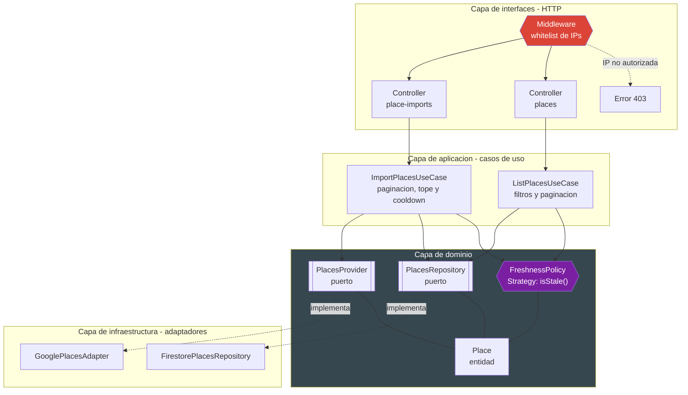
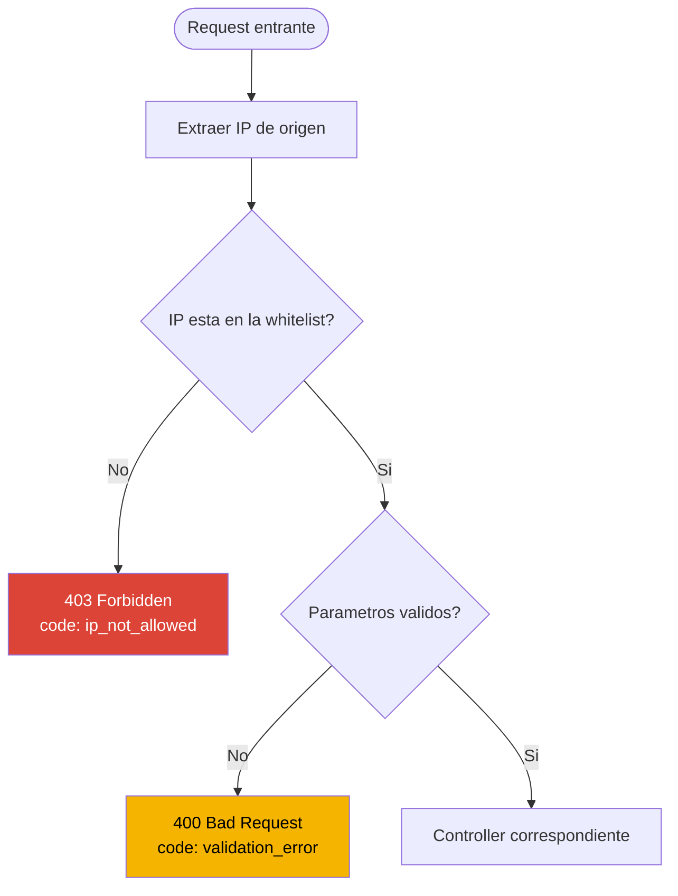
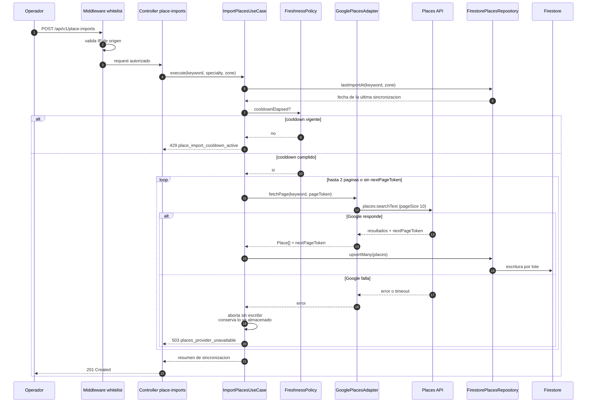
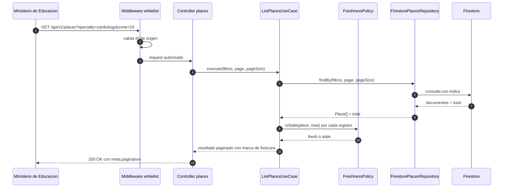
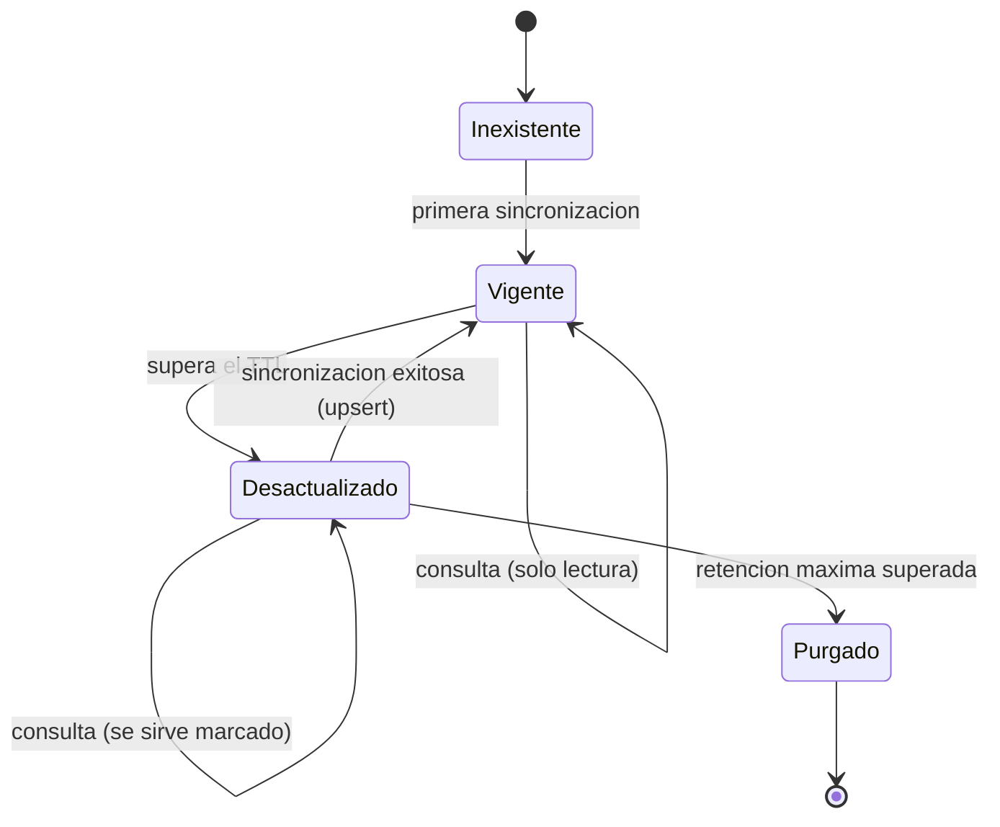
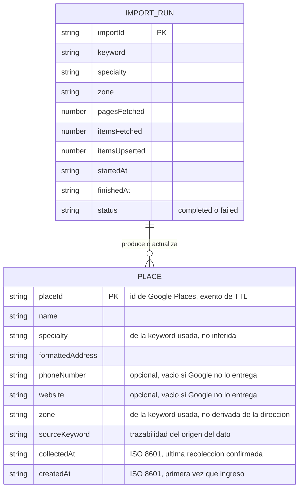

# Diseño del sistema: Medical Specialists Directory

Documento de diseño del proyecto. Define el problema, los requisitos, la arquitectura, los contratos de API, el modelo de datos y las decisiones tomadas. El enunciado del curso está transcrito en [statement.md](statement.md) y la descripción general del repositorio está en [README.md](../README.md).

## Problema y objetivo

El Ministerio de Educación de Guatemala necesita un directorio de médicos especialistas en Ciudad de Guatemala y responder consultas del tipo "cuántos oncólogos hay en la zona 4 de la capital", conservando esa información para uso posterior.

El sistema debe:

- Obtener información de especialistas y centros médicos desde Google Maps Platform (Places API).
- Persistir esa información en una base de datos propia que funcione como caché consultable.
- Exponer una API HTTP que el Ministerio consuma sin depender de Google en tiempo de consulta.
- Restringir el acceso al servicio a un conjunto de IPs autorizadas.
- Ofrecer una UI mínima de consulta.
- Operar dentro de un presupuesto acotado, con controles de costo verificables.

## Alcance

| Dentro del alcance                                     | Fuera del alcance                    |
| :----------------------------------------------------- | :----------------------------------- |
| API de sincronización contra Places API con paginación | Autenticación de usuarios finales    |
| API de consulta sobre base de datos propia             | Frontend elaborado o diseño visual   |
| Whitelist de IPs como control de acceso                | Georreferenciación avanzada o rutas  |
| Persistencia en Firestore como caché con vencimiento   | Multi-tenant o múltiples ministerios |
| UI mínima de consulta                                  | Analítica o reportería               |
| Controles de costo y cuota en GCP                      | Refresco automático programado       |

## Requisitos

### Funcionales

| ID    | Requisito                                                                                                             |
| :---- | :-------------------------------------------------------------------------------------------------------------------- |
| RF-01 | Consultar lugares médicos en Places API a partir de una keyword y una zona                                            |
| RF-02 | Recorrer los resultados paginados de Places API hasta un máximo de 20 registros por invocación, en páginas de 10      |
| RF-03 | Persistir los resultados en la base de datos propia sin duplicar registros existentes                                 |
| RF-04 | Exponer un endpoint de consulta que lea únicamente de la base de datos propia, sin llamar a Google en ningún caso     |
| RF-05 | Paginar la respuesta del endpoint de consulta con `page` y `pageSize`, con `pageSize` máximo de 50                    |
| RF-06 | Proveer una UI mínima que consuma el endpoint de consulta                                                             |
| RF-07 | Marcar cada registro como vigente o desactualizado según su fecha de recolección, y exponer esa marca en la respuesta |
| RF-08 | Registrar la keyword que originó cada registro, para trazabilidad del dato                                            |

### No funcionales

| ID     | Requisito                                                                                                                  |
| :----- | :------------------------------------------------------------------------------------------------------------------------- |
| RNF-01 | Solo IPs en whitelist pueden consumir el servicio; el resto recibe `403`                                                   |
| RNF-02 | La API key de Google nunca se versiona ni se expone al cliente; se lee de variables de entorno o Secret Manager            |
| RNF-03 | La lógica de negocio no depende de Firestore ni de Google Places (arquitectura limpia)                                     |
| RNF-04 | Todo el tráfico va sobre HTTPS                                                                                             |
| RNF-05 | El consumo contra Places API se acota por el tope de RF-02, por la cuota diaria en GCP y por el cooldown de sincronización |
| RNF-06 | El 90% del desarrollo ocurre contra el emulador de Firebase; producción se reserva para pruebas finales y demo             |
| RNF-07 | Ningún dato se infiere ni se completa por cuenta del sistema; los campos ausentes se persisten vacíos                      |

## Stack

| Componente            | Tecnología                                           |
| :-------------------- | :--------------------------------------------------- |
| Lenguaje              | TypeScript                                           |
| Backend               | Firebase Cloud Functions v2                          |
| Base de datos         | Firestore                                            |
| Hosting de UI         | Firebase Hosting                                     |
| Fuente de datos       | Google Maps Platform, Places API                     |
| Secretos              | Variables de entorno, Secret Manager en despliegue   |
| Entorno de desarrollo | Emulador de Firebase y Docker Compose                |
| Gestor de paquetes    | pnpm con workspaces                                  |
| Calidad               | ESLint, Prettier, TypeScript en modo estricto        |

### Organización del repositorio

El proyecto vive en un **monorepo** con workspaces de pnpm, y no en repositorios separados de backend y frontend como indica el estándar de repositorios del equipo.

```
apps/backend        API HTTP y capas de dominio, aplicacion e infraestructura
apps/frontend       UI minima de consulta
packages/contracts  Tipos y contratos compartidos entre backend y frontend
config              Configuracion de aplicacion versionada
docker              Definiciones de imagenes y emulador
docs                Documentacion del proyecto
```

Razones de la desviación:

- El contrato de la API lo consumen ambas aplicaciones. En `packages/contracts` vive una sola definición de tipos, de modo que un cambio de contrato rompe la compilación del frontend de inmediato en lugar de descubrirse en ejecución.
- Firebase despliega Functions y Hosting desde un mismo proyecto y un mismo `firebase.json`. Separar repositorios obligaría a coordinar dos despliegues para un cambio que es uno solo.
- Con cuatro semanas y cuatro personas, un solo `pnpm install` y un solo comando de arranque reducen más fricción de la que cuesta la separación.

### Docker

Docker Compose se usa como entorno de desarrollo reproducible, junto al emulador de Firebase. No forma parte del despliegue: producción es Cloud Functions y Hosting.

| Elemento                  | Propósito                                                                |
| :------------------------ | :----------------------------------------------------------------------- |
| `docker-compose.yml`      | Backend, frontend y emulador para desarrollo local                       |
| `docker-compose.prod.yml` | Superposición para verificar el build de producción antes de desplegar   |
| Perfil `emulator`         | Levanta el emulador de Firestore solo cuando se necesita                 |
| `WATCH_USE_POLLING`       | Habilita la recarga automática sobre volúmenes montados en WSL2          |

Los cuatro integrantes trabajan sobre sistemas distintos. Un entorno en contenedor elimina la clase de fallo en que el código corre en una máquina y no en otra, que en un proyecto de cuatro semanas consume tiempo que no se recupera.

Docker es opcional: `pnpm dev` levanta el proyecto sin contenedores, con persistencia en memoria y proveedor simulado.

### Cumplimiento de la arquitectura por herramientas

La regla de que el dominio no conoce la infraestructura (RNF-03) no queda solo escrita: ESLint la aplica. La configuración prohíbe importar `firebase-admin` en cualquier punto de `apps/backend` salvo dentro de `src/infrastructure` y el punto de entrada de las funciones.

Un caso de uso que intente hablar con Firestore directamente falla el lint, no la revisión de código. Es la diferencia entre una convención que se respeta por disciplina y una que se respeta porque el proyecto no compila sin ella.

## Arquitectura

El diseño combina dos decisiones:

- **Cliente-servicio**: la UI nunca accede directamente a Firestore ni a Google Maps. Todo pasa por las Firebase Functions, único componente que conoce esos detalles y que expone una API HTTP. El cliente consume contratos, no implementación.
- **Arquitectura limpia** dentro del servicio: la lógica de negocio no depende de detalles de infraestructura. Las capas son interfaces (HTTP), aplicación (casos de uso), dominio (puertos y políticas) e infraestructura (adaptadores).

### Diagrama 1: contexto

Actores y sistemas externos con los que interactúa la solución.


El operador es un integrante del equipo, no el cliente. La sincronización es una operación interna y no se expone en la UI.

### Diagrama 2: contenedores y despliegue

Piezas desplegables y dónde vive cada una.


La UI del Ministerio solo alcanza el endpoint de consulta. El endpoint de sincronización se invoca directamente por HTTP desde una IP autorizada, sin interfaz gráfica.

### Diagrama 3: capas y componentes

Estructura interna del servicio bajo arquitectura limpia. Las dependencias apuntan siempre hacia el dominio.



Responsabilidad de cada capa:

| Capa            | Responsabilidad                                                            | Qué nunca hace                        |
| :-------------- | :------------------------------------------------------------------------- | :------------------------------------ |
| Interfaces      | Traducir HTTP a llamada de caso de uso, validar entrada, aplicar whitelist | Decidir reglas de negocio             |
| Aplicación      | Orquestar paginación, aplicar el tope, decidir qué se guarda               | Conocer Firestore o Google Places     |
| Dominio         | Definir la entidad `Place`, los puertos y la política de frescura          | Depender de librerías externas        |
| Infraestructura | Saber _cómo_ hablar con Firestore y con Places API                         | Decidir _cuándo_ o _por qué_ se llama |

### Diagrama 4: flujo del middleware de whitelist

Control de acceso previo a cualquier controlador.



La IP autorizada es la IP pública de salida del cliente y cambia según la red desde la que se conecta, por lo que se administra como configuración y no como valor fijo en código.

### Diagrama 5: secuencia de sincronización con paginación

Único flujo que llama a Google. Recorre páginas de 10 hasta un máximo de 20 resultados por invocación.



Reglas del caso de uso:

- Tamaño de página fijo en 10 y tope de 20 resultados por invocación, es decir un máximo de 2 llamadas facturables por sincronización.
- El corte ocurre cuando se alcanza el tope o cuando Places API deja de devolver `nextPageToken`.
- La escritura es idempotente: se hace _upsert_ por `placeId`, de modo que repetir una sincronización no duplica registros.
- La escritura solo ocurre si Google respondió correctamente. Un fallo del proveedor nunca borra ni degrada lo que ya está almacenado.
- Un cooldown por combinación de keyword y zona impide que sincronizaciones repetidas consuman presupuesto sin aportar datos nuevos.

### Diagrama 6: secuencia de consulta

Flujo que consume el Ministerio. No toca Google en ningún momento.



La consulta nunca devuelve vacío por vencimiento. Un registro vencido se devuelve marcado como `stale`, junto con su `collectedAt`, para que quien consulta decida si le sirve.

### Diagrama 7: ciclo de vida del dato en caché



Tres reglas cierran el ciclo:

- La consulta nunca dispara una llamada a Google. La actualización es explícita y manual.
- Un registro desactualizado se sigue sirviendo, siempre marcado. Es preferible un dato viejo y etiquetado a una respuesta vacía que el Ministerio interpretaría como "no existen especialistas en esa zona".
- Pasada la retención máxima, el registro se purga. Solo el `placeId` puede conservarse indefinidamente, porque es el único campo exento de las restricciones de caché de Google.

## Política de caché y frescura

Esta sección responde a las [políticas de Places API](https://developers.google.com/maps/documentation/places/web-service/policies), que son explícitas:

> El `place_id`, que identifica de forma única un lugar, está exento de las restricciones de caché y puede almacenarse indefinidamente.

Y sobre el resto del contenido:

> El contenido, con excepción de los place IDs, no puede cachearse ni almacenarse salvo que un acuerdo lo permita.

Es decir, **no existe un "TTL máximo permitido" que el proyecto pueda citar**. Google concede almacenamiento permanente solo para el `placeId` y restringe todo lo demás. Google además recomienda refrescar los place IDs con más de 12 meses de antigüedad, y ese refresco no tiene costo.

Consecuencia para el diseño, declarada de forma abierta:

| Dato            | Tratamiento                                                 | Fundamento                                                              |
| :-------------- | :---------------------------------------------------------- | :---------------------------------------------------------------------- |
| `placeId`       | Se almacena sin vencimiento                                 | Exento de forma explícita por la política de Places                     |
| Resto de campos | Se almacena con TTL corto y se purga al vencer la retención | Desviación consciente de alcance académico, no redistribución comercial |

El TTL no se hereda de Google: **es una decisión del equipo que hay que justificar**. Se parametriza por entorno mediante constantes y no se repite en el código.

| Variable                 | Desarrollo y pruebas | Demo y producción       | Razón                                                                                                                                       |
| :----------------------- | :------------------- | :---------------------- | :------------------------------------------------------------------------------------------------------------------------------------------ |
| `PLACES_TTL_MINUTES`     | 30                   | 43200, es decir 30 días | En pruebas interesa ver la transición a `stale` sin esperar; en la demo un TTL corto marcaría casi todo como desactualizado sin motivo real |
| `PLACES_RETENTION_HOURS` | 24                   | 2160, es decir 90 días  | Ventana máxima antes de purgar los campos no exentos                                                                                        |
| `SYNC_COOLDOWN_MINUTES`  | 1                    | 60                      | Evita que sincronizaciones repetidas de la misma keyword consuman presupuesto                                                               |
| `PLACES_MAX_RESULTS`     | 20                   | 20                      | Límite fijado por el enunciado                                                                                                              |
| `PLACES_PAGE_SIZE`       | 10                   | 10                      | Dos llamadas facturables por sincronización                                                                                                 |

Los valores de demo y producción quedan sujetos a confirmación del equipo antes de la Semana 3. La plantilla completa está en `.env.example`.

## Configuración y entornos

Toda la configuración se resuelve por variables de entorno, con `.env.example` como plantilla versionada y `.env` fuera del repositorio.

### Selección de adaptadores

La arquitectura de puertos permite sustituir infraestructura sin tocar el dominio, y esa capacidad se expone como configuración. Es lo que hace posible desarrollar sin gastar crédito de Places API ni levantar Firestore.

| Variable                 | Valores               | Efecto                                             |
| :----------------------- | :-------------------- | :------------------------------------------------- |
| `PERSISTENCE_DRIVER`     | `memory`, `firestore` | Implementación activa de `PlacesRepository`        |
| `PLACES_PROVIDER_DRIVER` | `mock`, `google`      | Implementación activa de `PlacesProvider`          |
| `SEED_ON_STARTUP`        | `true`, `false`       | Carga datos de ejemplo al arrancar en modo memoria |

La combinación `memory` más `mock` permite que P2 y P4 avancen sin depender de P1 ni consumir presupuesto, y sostiene el requisito de desarrollar el 90% contra el entorno local. Los cuatro casos de uso son idénticos en ambos modos: es la prueba práctica de que el dominio no conoce la infraestructura.

### Red y transporte

| Variable                | Propósito                                                                                                                                                                              |
| :---------------------- | :------------------------------------------------------------------------------------------------------------------------------------------------------------------------------------- |
| `TRUST_PROXY_HOPS`      | Saltos de proxy confiables para resolver la IP real del cliente. Firebase Hosting usa 1. Un valor incorrecto haría que el middleware evalúe la IP del proxy en lugar de la del cliente |
| `CORS_ALLOWED_ORIGINS`  | Orígenes autorizados para consumir la API desde el navegador                                                                                                                           |
| `RATE_LIMIT_PER_MINUTE` | Peticiones por minuto y por IP antes de responder `429`. Es una segunda capa de contención independiente del cooldown de sincronización                                                |
| `API_BASE_PATH`         | Prefijo de las rutas, `/api/v1`                                                                                                                                                        |

El límite de peticiones y la whitelist cumplen funciones distintas: la whitelist decide **quién** puede consumir el servicio, el límite de peticiones decide **cuánto** puede consumir quien ya está autorizado.

## Patrones de diseño aplicados

| Patrón                           | Dónde vive                | Problema que resuelve                                                                                                                   |
| :------------------------------- | :------------------------ | :-------------------------------------------------------------------------------------------------------------------------------------- |
| **Strategy** (`FreshnessPolicy`) | Dominio                   | Centraliza la regla "¿este dato está viejo?" en un solo lugar. Cambiar el TTL no toca casos de uso ni adaptadores                       |
| **Stale-if-error**               | `ImportPlacesUseCase`     | Si Google falla, se conserva lo almacenado en vez de degradarlo. El TTL deja de ser un apagador que apaga la luz cuando más se necesita |
| **Write-on-success**             | `ImportPlacesUseCase`     | El dato viejo solo se reemplaza cuando llega uno nuevo confirmado. Nunca queda un hueco entre borrar y escribir                         |
| **Servir stale marcado**         | `ListPlacesUseCase`       | Ante un dato vencido se responde con la marca de frescura, nunca con una lista vacía que se leería como ausencia de especialistas       |
| **Cooldown de sincronización**   | `ImportPlacesUseCase`     | Acota el gasto de un endpoint que cuesta dinero real en cada invocación                                                                 |
| **Puertos y adaptadores**        | Dominio e infraestructura | Permite sustituir Firestore o Places API sin tocar la lógica de negocio, y probar los casos de uso con dobles en el emulador            |

Patrón evaluado y descartado:

- **Cache-aside con refresco en lectura**: la consulta detectaría el dato vencido y llamaría a Google en ese momento. Se descarta porque reintroduce el costo y la latencia de Google en el flujo de consulta, vuelve el gasto impredecible ante picos de tráfico y expone al sistema a un _cache stampede_ cuando varias consultas simultáneas encuentran el mismo dato vencido.
- **Refresco automático programado** con Cloud Scheduler: se descarta porque el cliente no lo pidió, agrega un componente desplegable y un costo recurrente que el alcance de cuatro semanas no justifica.

## Modelo de datos

Colección `places` en Firestore, con el `placeId` de Google como identificador del documento.

Los campos se nombran en inglés. El enunciado los lista en español; esta es la correspondencia exacta:

| Campo del enunciado | Campo del proyecto | Obligatorio            |
| :------------------ | :----------------- | :--------------------- |
| `place_id`          | `placeId`          | Sí                     |
| `nombre`            | `name`             | Sí                     |
| `especialidad`      | `specialty`        | Sí                     |
| `dirección`         | `formattedAddress` | Sí                     |
| `teléfono`          | `phoneNumber`      | No, puede quedar vacío |
| `sitio_web`         | `website`          | No, puede quedar vacío |
| `zona`              | `zone`             | Sí                     |
| `fecha_recoleccion` | `collectedAt`      | Sí                     |
| `keyword_usado`     | `sourceKeyword`    | Sí                     |



Tres decisiones del modelo que hay que poder defender:

- **`zone` y `specialty` provienen de la keyword, no de la dirección.** Derivar la zona a partir del texto de la dirección sería inferir un dato que Google no entregó, lo que el enunciado prohíbe de forma expresa. Si la búsqueda fue `cardiólogo zona 10 Guatemala`, entonces `zone` vale `10` porque así se pidió, y `sourceKeyword` conserva la evidencia.
- **`phoneNumber` y `website` se guardan vacíos cuando Google no los entrega.** No se completan con datos de otras fuentes ni se sustituyen por redes sociales. La cobertura real de estos campos se reporta en la documentación.
- **No se almacenan `latitude`, `longitude` ni `rating`.** El enunciado no los pide, la UI no los usa y la georreferenciación está fuera del alcance. Persistir menos campos es coherente con la minimización declarada en la postura ética.

Índices requeridos en Firestore:

- Compuesto sobre `specialty` y `zone` para el filtro principal.
- Simple sobre `collectedAt` para detectar registros vencidos y purgar los que superen la retención.

## Contratos de API

Base: `/api/v1`. Respuestas en JSON con propiedades en camelCase, sobre HTTPS.

El enunciado propone `GET /directorio` con parámetros en español. El equipo mantiene rutas y parámetros en inglés y con versionado explícito, por consistencia con el resto del código y con la convención REST. La desviación queda registrada en [statement.md](statement.md).

### `POST /api/v1/place-imports`

Dispara una sincronización desde Places API hacia la base propia. No se expone en la UI.

Request:

```json
{
  "keyword": "cardiologo zona 10 Guatemala",
  "specialty": "cardiology",
  "zone": "10"
}
```

Respuesta `201 Created`:

```json
{
  "code": "place_import_created",
  "message": "Place import completed successfully",
  "data": {
    "importId": "imp_001",
    "keyword": "cardiologo zona 10 Guatemala",
    "specialty": "cardiology",
    "zone": "10",
    "pagesFetched": 2,
    "itemsFetched": 20,
    "itemsUpserted": 18
  }
}
```

### `GET /api/v1/places`

Consulta la base propia. No llama a Google.

Query params:

| Parámetro   | Tipo   | Descripción                                 |
| :---------- | :----- | :------------------------------------------ |
| `specialty` | string | Especialidad médica a filtrar               |
| `zone`      | string | Zona administrativa                         |
| `q`         | string | Búsqueda de texto libre sobre el nombre     |
| `page`      | number | Página actual, por defecto 1                |
| `pageSize`  | number | Tamaño de página, por defecto 10, máximo 50 |

Respuesta `200 OK`:

```json
{
  "code": "place_list",
  "message": "Resources list retrieved successfully",
  "data": [
    {
      "placeId": "ChIJ_example_1",
      "name": "Centro Cardiologico Zona 10",
      "specialty": "cardiology",
      "formattedAddress": "4a Avenida 12-34 Zona 10, Guatemala",
      "phoneNumber": "+502 2222 3333",
      "website": "",
      "zone": "10",
      "sourceKeyword": "cardiologia zona 10 Guatemala",
      "collectedAt": "2026-08-05T14:32:00Z",
      "stale": false
    }
  ],
  "meta": {
    "pagination": {
      "page": 1,
      "pageSize": 10,
      "totalItems": 47,
      "totalPages": 5
    }
  }
}
```

El campo `stale` es booleano: vale `true` cuando el registro superó el TTL. Un `phoneNumber` o un `website` vacío se devuelve como cadena vacía, nunca omitido ni sustituido por otra fuente.

### `GET /api/v1/specialties`

Devuelve el catálogo de especialidades soportadas con sus variantes de búsqueda. La UI lo consume para construir el selector, de modo que un cambio de catálogo no exige tocar el frontend.

Respuesta `200 OK`:

```json
{
  "code": "specialty_list",
  "message": "Specialty catalog retrieved successfully",
  "data": [
    {
      "specialty": "cardiology",
      "keywords": ["cardiologia", "clinica cardiologica", "centro cardiovascular"]
    }
  ]
}
```

No lleva paginación: es un catálogo cerrado de diez elementos, la excepción prevista en el estándar de API. Las etiquetas visibles no vienen aquí; el frontend las resuelve con la clave `specialty_<key>` en sus diccionarios.

### Política de errores

El backend no devuelve mensajes destinados al usuario final. Cada respuesta lleva dos campos con audiencias distintas, conforme al estándar de i18n del proyecto:

| Campo     | Audiencia                                                                 | Naturaleza                                                                  |
| :-------- | :------------------------------------------------------------------------ | :-------------------------------------------------------------------------- |
| `code`    | La máquina. El frontend lo usa como clave del diccionario de traducciones | Estable, en inglés, snake_case, nunca se traduce ni se reformula            |
| `message` | El desarrollador, en logs y depuración                                    | Técnico, puede cambiar sin romper clientes porque nadie depende de su texto |

Esta separación permite que el texto que ve el usuario cambie de idioma o de redacción sin tocar el backend.

Catálogo de códigos:

| Código HTTP | `code`                         | Cuándo ocurre                                                               |
| :---------- | :----------------------------- | :-------------------------------------------------------------------------- |
| `200`       | `place_list`                   | Consulta exitosa del directorio                                             |
| `201`       | `place_import_created`         | Sincronización completada                                                   |
| `400`       | `validation_error`             | Parámetros ausentes o mal formados, incluido `pageSize` mayor a 50          |
| `403`       | `ip_not_allowed`               | IP de origen fuera de la whitelist                                          |
| `200`       | `specialty_list`               | Catálogo de especialidades consultado                                       |
| `404`       | `resource_not_found`           | Recurso inexistente                                                         |
| `422`       | `specialty_not_supported`      | Especialidad fuera del catálogo soportado                                   |
| `422`       | `zone_not_supported`           | Zona fuera de las 22 zonas válidas de Ciudad de Guatemala                   |
| `429`       | `place_import_cooldown_active` | Se intentó sincronizar la misma keyword y zona antes de cumplir el cooldown |
| `429`       | `rate_limit_exceeded`          | Se superó el límite de peticiones por minuto para el origen                 |
| `500`       | `internal_error`               | Error no controlado                                                         |
| `503`       | `places_provider_unavailable`  | Places API no responde o agota cuota                                        |

Los códigos siguen la convención `recurso_condicion` del estándar de i18n. Se descartaron formas invertidas como `unsupported_specialty`, que nombran primero la condición, para mantener consistencia con el resto del catálogo.

Sobre el `403`: la tabla de estándares lo define como "autenticado pero sin permisos". Aquí no hay autenticación, y esa es justamente la razón de usarlo en lugar de `401`: no existe credencial que el cliente pueda presentar para corregir la situación, su origen simplemente no está autorizado. El enunciado exige `403` de forma explícita.

Formato de error:

```json
{
  "code": "ip_not_allowed",
  "message": "Request origin is not allowed"
}
```

Error de validación con detalle por campo:

```json
{
  "code": "validation_error",
  "message": "Request validation failed",
  "errors": {
    "details": [
      {
        "field": "pageSize",
        "code": "out_of_range",
        "message": "pageSize must be between 1 and 50"
      }
    ]
  }
}
```

Ningún mensaje de error expone nombres de colecciones, la API key ni trazas internas. El `message` es técnico, pero no revela estructura interna del sistema.

### `GET /health`

Endpoint de verificación de estado, sin prefijo de versión y **exento del middleware de whitelist**.

La exención es necesaria: la comprobación de salud del contenedor se origina dentro del propio contenedor, con una IP interna que nunca estará en la lista de orígenes autorizados. Someterlo a la whitelist haría que el orquestador considerara el servicio caído de forma permanente.

Para que la exención no abra superficie, el endpoint cumple tres condiciones:

- Responde únicamente `200` con `{ "code": "service_healthy" }`. Sin datos, sin versiones, sin nombres de dependencias.
- No consulta Firestore ni Places API. Verificar que el proceso responde no debe costar dinero ni carga.
- No revela si las dependencias están configuradas. Un atacante no puede usarlo para inferir el estado interno del sistema.

### Diccionarios de traducción

Viven en el frontend, en `src/i18n/`, con un archivo por idioma. El proyecto mantiene `es.json` y `en.json`, ambos obligatorios. El backend no los conoce ni los importa.

```json
// es.json
{
  "place_list": "Directorio consultado correctamente",
  "place_import_created": "Sincronizacion completada",
  "validation_error": "Revisa los datos de la busqueda",
  "specialty_list": "Catalogo de especialidades",
  "zone_not_supported": "Esa zona no esta disponible en el directorio",
  "resource_not_found": "No se encontro lo que buscabas",
  "required_field": "Este campo es obligatorio",
  "invalid_type": "El valor no tiene el formato esperado",
  "out_of_range": "El valor esta fuera del rango permitido",
  "not_in_catalog": "El valor no esta entre las opciones disponibles",
  "ip_not_allowed": "No tienes acceso al servicio desde esta red. Contacta al administrador",
  "specialty_not_supported": "Esa especialidad no esta disponible en el directorio",
  "place_import_cooldown_active": "Esta busqueda se sincronizo hace poco. Intenta mas tarde",
  "rate_limit_exceeded": "Demasiadas peticiones. Espera un momento antes de continuar",
  "internal_error": "Ocurrio un error inesperado. Intenta de nuevo mas tarde",
  "places_provider_unavailable": "El servicio de datos no esta disponible en este momento"
}
```

Toda clave nueva se agrega a los dos diccionarios en el mismo Pull Request. Si falta una traducción, se resuelve con el idioma de respaldo antes de mostrar la clave cruda.

## Seguridad

| Control               | Implementación                                                                                                                                                                                          |
| :-------------------- | :------------------------------------------------------------------------------------------------------------------------------------------------------------------------------------------------------ |
| Acceso al servicio    | Whitelist de IPs aplicada en middleware antes de cualquier controlador                                                                                                                                  |
| API key de Google     | Leída de variables de entorno o Secret Manager; nunca versionada ni enviada al cliente                                                                                                                  |
| Restricción de la key | Restringida en la consola de GCP para funcionar solo desde las IPs del proyecto, y limitada a Places API                                                                                                |
| Transporte            | HTTPS obligatorio                                                                                                                                                                                       |
| Superficie expuesta   | La UI solo conoce `GET /api/v1/places`. El endpoint de sincronización no se expone en la interfaz ni tiene botón, porque cada invocación tiene costo real y un control visible sería un vector de gasto |
| Costo                 | Tope de 20 resultados por sincronización, cooldown por keyword y cuota diaria en la consola de APIs                                                                                                     |
| Validación            | Todo parámetro de entrada se valida antes de llegar al caso de uso                                                                                                                                      |

Cada integrante del equipo usa su propia API key en desarrollo. Compartir una key multiplica el riesgo de consumo no controlado sobre una sola cuenta.

### Administración de la whitelist

La IP autorizada es la IP pública de salida del cliente y cambia con la red desde la que se conecta. Un equipo que trabaja desde la universidad, desde casa y desde la demo necesita modificar la lista varias veces, de modo que la whitelist se administra como **configuración editable sin redeploy**: un documento en Firestore que el middleware lee en cada request, no una constante compilada.

**El documento se edita desde la consola de Firebase.** No existe endpoint de administración de la whitelist.

|                     | Consola de Firebase, adoptada         | Endpoint de administración, descartado    |
| :------------------ | :------------------------------------ | :---------------------------------------- |
| Código a escribir   | Ninguno                               | Endpoint, validación y manejo del secreto |
| Autenticación       | Cuenta de Google con segundo factor   | Secreto compartido en variable de entorno |
| Superficie expuesta | Ninguna                               | Un endpoint alcanzable desde internet     |
| Trazabilidad        | Registro por cuenta de quién modificó | Nula, todos usan la misma llave           |
| Riesgo principal    | Requiere abrir la consola             | Filtración del secreto anula la whitelist |

La razón que decide es estructural, no de comodidad. Un endpoint de administración solo resuelve el caso de un integrante que llega desde una red nueva si **no está detrás del middleware de whitelist**: estando detrás, únicamente una IP ya autorizada podría agregar otras, y con la lista vacía o desactualizada el equipo quedaría permanentemente fuera de su propio sistema. Esa exposición obligada tendría que compensarse con un secreto compartido entre cuatro personas, lo que constituye un mecanismo de autenticación más débil que el que la consola de Firebase ya provee sin escribir código.

Cambiar de red implica editar un documento en la consola. Es un costo operativo menor frente a mantener un endpoint sin protección de red y con un secreto que no distingue quién lo usó.

Cloud Armor se contempla como alternativa avanzada al middleware de whitelist. No es requerido para nota completa y su adopción queda pendiente de decisión del equipo; si se implementa, se documenta la diferencia frente al middleware.

## Control de costos

El presupuesto es un requisito del proyecto, no una recomendación. Cada integrante responde por el gasto de su cuenta.

| Dato                                                | Valor                                                |
| :-------------------------------------------------- | :--------------------------------------------------- |
| Crédito mensual de Places API                       | 200 USD                                              |
| Costo por llamada, referencia del enunciado         | 0.017 USD                                            |
| SKU aplicable al proyecto                           | Enterprise, por requerir teléfono y sitio web        |
| Precio real del SKU Enterprise                      | **Por verificar en la consola de pricing, Semana 1** |
| Llamadas equivalentes al crédito, con la referencia | Alrededor de 11,700 al mes                           |
| Llamadas facturables por sincronización             | 2, por el tope de 20 resultados en páginas de 10     |
| Costo por sincronización, con la referencia         | 0.034 USD                                            |
| Límite duro por sincronización                      | 1 USD                                                |

El costo por llamada depende del field mask solicitado y no es un valor único. El detalle de SKUs está en la estrategia de keywords. Ninguna corrida completa se ejecuta antes de confirmar el precio real.

Controles obligatorios, previos a escribir código:

| Control                                   | Configuración                             | Responsable              |
| :---------------------------------------- | :---------------------------------------- | :----------------------- |
| Alerta de billing al 50% del presupuesto  | Consola de GCP, Billing, Budgets & alerts | Cada integrante          |
| Alerta de billing al 90% del presupuesto  | Consola de GCP, Billing, Budgets & alerts | Cada integrante          |
| Cuota máxima de llamadas por día          | Consola de APIs, Places API, Quotas       | Cada integrante          |
| Emulador local para el 90% del desarrollo | Firebase Emulator Suite                   | P3 configura, todos usan |

El valor exacto de la cuota diaria queda por confirmar con el equipo. Como punto de partida se propone un límite conservador que cubra el uso previsto de pruebas sin acercarse al crédito mensual.

### Evidencia de configuración

Entregable de la Semana 1. Las capturas se guardan en `docs/images/` y se enlazan aquí.

| Evidencia                        | Archivo                          | Estado    |
| :------------------------------- | :------------------------------- | :-------- |
| Alerta de billing al 50%         | `images/billing-alert-50.png`    | Pendiente |
| Alerta de billing al 90%         | `images/billing-alert-90.png`    | Pendiente |
| Cuota diaria de Places API       | `images/places-api-quota.png`    | Pendiente |
| Restricción de la API key por IP | `images/api-key-restriction.png` | Pendiente |
| Función `hello world` desplegada | `images/hello-world-deploy.png`  | Pendiente |

<!-- Al agregar cada captura, sustituir el estado por el enlace:  -->

## Estrategia de keywords

El enunciado exige diseñar y documentar esta estrategia **antes** de ejecutar cualquier búsqueda. Su calidad pesa en la evaluación de la Semana 2.

El problema de fondo: Google Maps no tiene un campo que declare "este profesional es cardiólogo". Tiene nombres de negocio, categorías y reseñas. La keyword no es un detalle de implementación, es la decisión que determina **qué queda dentro y qué queda fuera del directorio**.

### Catálogo cerrado

El usuario no escribe texto libre. Tanto la especialidad como la zona provienen de catálogos cerrados. Esto acota el costo, evita búsquedas arbitrarias contra un endpoint facturable y hace que la cobertura sea documentable.

Ambos catálogos viven en `packages/contracts/src/specialty.ts`, no en un archivo de configuración. La razón es que de esa lista se deriva el tipo `Specialty`: backend y frontend obtienen verificación en tiempo de compilación, y una especialidad inexistente falla al compilar en lugar de en ejecución. Un JSON no puede dar esa garantía.

Las etiquetas que ve el usuario no están en el catálogo: se resuelven en los diccionarios de traducción con la clave `specialty_<key>`, de modo que el catálogo permanezca libre de texto de interfaz.

Zonas válidas de Ciudad de Guatemala: **1 a 19, 21, 24 y 25**. Son 22 zonas en total. Las zonas 20, 22 y 23 no existen: al delimitar el municipio se determinó que ese territorio pertenecía a Mixco, San Miguel Petapa y Santa Catarina Pinula respectivamente. Incluirlas en el catálogo gastaría llamadas facturables en búsquedas sin territorio.

Especialidades soportadas, diez en total: cardiología, pediatría, ginecología, dermatología, traumatología, oftalmología, neurología, psiquiatría, oncología y medicina interna.

### Límite estructural de la API

Places API no ofrece tipos por especialidad médica. Los tipos disponibles en la categoría de salud son `chiropractor`, `dental_clinic`, `dentist`, `doctor`, `drugstore`, `hospital`, `pharmacy`, `spa` y `yoga_studio`. No existe `cardiologist`, `pediatrician` ni equivalente.

De aquí se derivan dos consecuencias que ninguna keyword puede resolver:

- La especialidad **solo puede provenir del texto de la consulta**, porque Google no la modela como atributo.
- Un negocio cuyo nombre no mencione la especialidad no será encontrado por ninguna variante. Los consultorios reales suelen llamarse "Centro Médico El Prado", no "cardiólogo", de modo que la recolección favorece a quienes usan la especialidad como parte de su nombre comercial.

Esta limitación se declara en la postura ética y no se disimula con más variantes.

### Filtrado por tipo

El ruido se ataca con `includedType` y `strictTypeFiltering`, no con la keyword. Cada búsqueda declara el tipo esperado, lo que descarta farmacias, tiendas y negocios que aparecen por coincidencias en reseñas.

| Parámetro             | Valor                                        | Propósito                                                         |
| :-------------------- | :------------------------------------------- | :---------------------------------------------------------------- |
| `includedType`        | `doctor`, o `hospital` según la especialidad | Restringe el resultado a establecimientos médicos                 |
| `strictTypeFiltering` | `true`                                       | Aplica el filtro a todas las consultas, no solo a las categóricas |
| `languageCode`        | `es`                                         | Resultados en español                                             |
| `regionCode`          | `GT`                                         | Sesgo regional a Guatemala                                        |

### Ejes de variación de una keyword

Todas las variantes derivan de una misma raíz, pero **no todas las formas derivadas nombran lo mismo**, y esa diferencia decide cuáles sirven. Places API indexa establecimientos, no personas: una forma que designa a un profesional le pide a un catálogo de negocios algo que no contiene.

| Forma            | Nombre lingüístico                     | Qué designa                                                                   | Uso                                                                             |
| :--------------- | :------------------------------------- | :---------------------------------------------------------------------------- | :------------------------------------------------------------------------------ |
| `cardiólogo`     | Sustantivo agentivo                    | A la persona que ejerce la especialidad                                       | **Descartada** por defecto, salvo que la prueba empírica demuestre lo contrario |
| `cardiología`    | Sustantivo de disciplina               | Al campo del saber, usado como nombre de servicio                             | Variante principal                                                              |
| `cardiológica`   | Adjetivo relacional                    | Califica al establecimiento                                                   | Variante principal, combinada con el tipo de establecimiento                    |
| `cardiovascular` | Adjetivo relacional de campo semántico | Califica al establecimiento con un término del mismo dominio, **no sinónimo** | Variante secundaria, cuando el término existe para esa especialidad             |

Dos ejes adicionales, independientes de la forma de la palabra:

| Eje                     | Qué es                                         | Ejemplo                              | Tratamiento                                       |
| :---------------------- | :--------------------------------------------- | :----------------------------------- | :------------------------------------------------ |
| Tipo de establecimiento | Modificador del negocio, no del término médico | `clínica`, `centro`, `consultorio`   | Se antepone al término médico                     |
| Variante ortográfica    | Diacríticos, con tilde y sin tilde             | `cardiologia` frente a `cardiología` | **Pendiente de verificación empírica**, ver abajo |

Criterio que gobierna la selección: **una variante se incluye solo si puede funcionar como nombre de un establecimiento real**. No basta con que sea una derivación gramaticalmente válida. Un sustantivo agentivo es correcto en español y describe con precisión al profesional, pero no es como se llama un local, y gastar llamadas facturables en él reduce cobertura sin aportar registros.

El ejemplo que trae el enunciado, `cardiólogo zona 10 Guatemala`, usa precisamente la forma agentiva. El equipo se aparta de ese ejemplo por la razón anterior, y la decisión se respalda con la prueba descrita más abajo en lugar de sostenerse solo en el argumento.

### Plantilla de keyword

```
textQuery      = "{término} zona {zona} Guatemala"
includedType   = doctor | hospital
strictTypeFiltering = true
languageCode   = es
regionCode     = GT
```

Google advierte que Text Search no está diseñada para consultas ambiguas y recomienda evitar consultas con múltiples conceptos. La plantilla combina tres: término médico, zona y ciudad.

Se conserva de todos modos, por una razón deliberada: la alternativa es separar la geografía con `locationBias` o `locationRestriction`, que aceptan círculos y rectángulos. Las zonas de Ciudad de Guatemala no son figuras regulares, de modo que aproximarlas geométricamente asignaría zona por cálculo y no por declaración. Eso sería inferir un dato que Google no entrega, que es justamente lo que el proyecto prohíbe. Manteniendo la zona en el texto, el valor de `zone` proviene de una decisión explícita del operador y queda trazado en `sourceKeyword`.

El costo de esta decisión es mayor ruido en los resultados, mitigado por `strictTypeFiltering` y reportado en la cobertura.

Entre 2 y 5 variantes de `{término}` por especialidad, con 3 como valor de referencia:

| Variante | Forma                                   | Ejemplo en cardiología  |
| :------- | :-------------------------------------- | :---------------------- |
| 1        | Sustantivo de disciplina                | `cardiología`           |
| 2        | Establecimiento más adjetivo relacional | `clínica cardiológica`  |
| 3        | Establecimiento más campo semántico     | `centro cardiovascular` |

### Variantes por especialidad

Propuesta inicial, sujeta a validación contra nombres comerciales reales durante la Semana 2. La columna de forma agentiva se incluye solo como referencia de lo que se descarta.

| Especialidad     | Clave             | Agentivo, descartado | Disciplina       | Adjetivo relacional | Campo semántico    |
| :--------------- | :---------------- | :------------------- | :--------------- | :------------------ | :----------------- |
| Oncología        | `oncology`        | oncólogo             | oncología        | oncológica          | —                  |
| Cardiología      | `cardiology`      | cardiólogo           | cardiología      | cardiológica        | cardiovascular     |
| Pediatría        | `pediatrics`      | pediatra             | pediatría        | pediátrica          | infantil médico    |
| Dermatología     | `dermatology`     | dermatólogo          | dermatología     | dermatológica       | —                  |
| Ginecología      | `gynecology`      | ginecólogo           | ginecología      | ginecológica        | gineco-obstétrico  |
| Neurología       | `neurology`       | neurólogo            | neurología       | neurológica         | neurociencias      |
| Oftalmología     | `ophthalmology`   | oftalmólogo          | oftalmología     | oftalmológica       | —                  |
| Ortopedia        | `orthopedics`     | ortopedista          | ortopedia        | ortopédica          | traumatología      |
| Psiquiatría      | `psychiatry`      | psiquiatra           | psiquiatría      | psiquiátrica        | salud mental       |
| Medicina general | `generalMedicine` | médico general       | medicina general | —                   | —                  |

No todas las especialidades completan las tres formas, y forzarlas sería contraproducente:

- **Medicina general** carece de adjetivo relacional de uso comercial y se queda en dos variantes. Además es la única entrada del catálogo que no es una especialidad en sentido estricto: se incluye porque buena parte de la oferta médica de barrio se registra así, y su presencia se declara en el reporte de cobertura para no presentarla como especialización.
- **Dermatología** tiene un término de campo semántico obvio, `piel`, que se descarta porque arrastra spas y centros de estética. El filtro `includedType` reduce ese ruido pero no lo elimina.
- **Oftalmología** tendría `óptica`, que se descarta porque designa un comercio de lentes y no un servicio médico.
- **Ortopedia** conserva `traumatología` como campo semántico. Son especialidades vecinas y muchos establecimientos usan ambos términos, de modo que la variante amplía cobertura real en lugar de arrastrar otro rubro.
- **Psiquiatría** comparte el término `salud mental` con psicología, que no está en el catálogo. Los registros que ingresen por esa vía deben revisarse antes de darlos por válidos.

Cada término de campo semántico se evalúa individualmente. Un término que arrastra un rubro distinto al médico se descarta aunque sea correcto en el lenguaje común.

### Verificaciones previas

Dos decisiones de la estrategia se apoyan en argumentos razonables pero no comprobados. Antes de la corrida completa se resuelven con pruebas de dos llamadas cada una, comparando los `placeId` devueltos.

| Prueba                           | Consultas a comparar                                                     | Qué decide                                                                                                                                               |
| :------------------------------- | :----------------------------------------------------------------------- | :------------------------------------------------------------------------------------------------------------------------------------------------------- |
| Forma agentiva contra disciplina | `cardiólogo zona 10 Guatemala` frente a `cardiología zona 10 Guatemala`  | Si el agentivo aporta registros que la disciplina no encuentra, se conserva como variante; si aporta menos o los mismos, se descarta de forma definitiva |
| Diacríticos                      | `cardiología zona 10 Guatemala` frente a `cardiologia zona 10 Guatemala` | Si los resultados coinciden, el eje ortográfico se elimina y las variantes se reservan para ejes que sí aportan cobertura                                |

Costo conjunto: 0.068 USD con la tarifa de referencia. Cada prueba registra el número de resultados, cuántos `placeId` son exclusivos de cada consulta y cuántos coinciden.

El valor de estas pruebas no es solo técnico. Dejan por escrito que la estrategia de keywords se decidió con evidencia y no por intuición, incluso cuando la evidencia contradice el ejemplo del enunciado.

### Presupuesto de la estrategia

Places API no cobra una tarifa única por llamada: cobra por **SKU según los campos solicitados en el field mask**, y una petición que mezcla campos de varios SKU se factura al más alto de ellos.

| SKU                | Campos que lo disparan                                                                    | Uso en el proyecto                                                |
| :----------------- | :---------------------------------------------------------------------------------------- | :---------------------------------------------------------------- |
| Essentials ID Only | `places.id`, `places.name`, `places.attributions`                                         | Insuficiente: no devuelve nombre legible ni dirección             |
| Pro                | `places.displayName`, `places.formattedAddress`, `places.location`, `places.types`        | Cubre nombre y dirección                                          |
| **Enterprise**     | `places.nationalPhoneNumber`, `places.websiteUri`, `places.rating`, horarios, price level | **El proyecto cae aquí**: el enunciado exige teléfono y sitio web |

Consecuencia directa: como `phoneNumber` y `website` son obligatorios por enunciado, **toda sincronización se factura al SKU Enterprise**. La referencia de 0.017 USD por llamada que da el enunciado corresponde a un SKU inferior, por lo que el costo real será mayor.

**El precio exacto del SKU Enterprise debe verificarse en la consola de pricing de GCP durante la Semana 1**, antes de ejecutar la corrida completa. Las cifras siguientes usan la referencia de 0.017 USD y quedan sujetas a corrección una vez confirmado el precio real.

Field mask que usa el adaptador, sin campos que no se persisten:

```
places.id,places.displayName,places.formattedAddress,places.nationalPhoneNumber,places.websiteUri,places.nextPageToken
```

Se excluye `places.rating` de forma deliberada: dispara Enterprise igual que los anteriores, pero no se persiste ni se usa, de modo que solicitarlo sería pagar por un dato descartado.

Alternativa evaluada y descartada: solicitar solo campos Pro en Text Search y completar teléfono y sitio web con llamadas a Place Details. Serían 2 llamadas Pro más hasta 20 llamadas de Details por sincronización, frente a 2 llamadas Enterprise. La opción de una sola pasada es más barata en cualquier escenario.

| Escenario                     | Sincronizaciones | Llamadas | Costo con referencia de 0.017 USD |
| :---------------------------- | :--------------- | :------- | :-------------------------------- |
| Una sincronización individual | 1                | 2        | 0.034 USD                         |
| Corrida completa, 2 variantes | 440              | 880      | 14.96 USD                         |
| Corrida completa, 3 variantes | 660              | 1,320    | 22.44 USD                         |
| Corrida completa, 5 variantes | 1,100            | 2,200    | 37.40 USD                         |

Dos límites distintos, que no deben confundirse:

- **Por operación**: una sincronización nunca debe superar 1 USD. Con 2 llamadas por invocación el costo con la tarifa de referencia es de 0.034 USD. Aun si el SKU Enterprise costara diez veces más, el límite se mantendría. Si una sola sincronización se acercara a 1 USD, significaría que el tope de resultados o el tamaño de página fueron alterados y hay que revisarlo.
- **Por campaña**: una corrida completa del catálogo no es una operación sino una campaña planificada, y requiere presupuesto declarado y aprobación previa del equipo. Se recalcula con el precio real del SKU antes de ejecutarla.

### Ejecución

Las 660 combinaciones de especialidad, variante y zona no se disparan a mano. El operador ejecuta un script que recorre el catálogo e invoca `POST /api/v1/place-imports` por cada combinación. Sigue siendo una acción deliberada y no un proceso programado, y como el cooldown opera por keyword y zona, un recorrido de combinaciones distintas no lo activa.

### Cobertura que queda fuera

La estrategia tiene límites conocidos que se reportan de forma explícita y no se disimulan:

- Un especialista cuyo negocio esté registrado solo con su nombre propio, sin mención de la especialidad, no aparece con ninguna variante.
- Los especialistas que atienden dentro de hospitales generales o centros de salud públicos no aparecen como registro independiente.
- Las especialidades fuera del catálogo de diez no se recolectan.
- La cobertura de Google Maps no es uniforme entre zonas, lo que se aborda en la postura ética.

## Decisiones de diseño

| Decisión                                           | Alternativa descartada                           | Razón                                                                                                        |
| :------------------------------------------------- | :----------------------------------------------- | :----------------------------------------------------------------------------------------------------------- |
| Dos endpoints separados: sincronización y consulta | Un endpoint que consulte Google en cada request  | Aísla el costo y la latencia de Google del flujo de consulta y permite servir desde caché                    |
| Firestore como caché persistente                   | Caché en memoria de la función                   | Las Cloud Functions son efímeras; la información debe sobrevivir entre invocaciones                          |
| Sincronización manual                              | Refresco automático con Cloud Scheduler          | El cliente no lo pidió, agrega un componente desplegable y costo recurrente sin aportar a la evaluación      |
| Sin botón de sincronizar en la UI                  | Botón visible para el usuario                    | Cada invocación tiene costo real; un control público es un vector de gasto no controlado                     |
| Servir el dato vencido marcado                     | Ocultarlo o devolver vacío                       | Una lista vacía se leería como ausencia de especialistas, que es peor que un dato viejo etiquetado           |
| Escribir solo si Google respondió                  | Borrar al vencer el TTL                          | Evita quedarse sin dato justo cuando el proveedor falla                                                      |
| `zone` tomada de la keyword                        | Derivarla del texto de la dirección              | Derivar es inferir, y el enunciado lo prohíbe                                                                |
| Puertos e implementaciones separadas               | Llamar al SDK de Firestore desde el caso de uso  | Permite sustituir base de datos o proveedor sin tocar la lógica de negocio                                   |
| Whitelist en código además de configuración en GCP | Solo configuración en la consola de GCP          | Deja el control versionado y auditable junto al resto del sistema                                            |
| Upsert por `placeId`                               | Insertar siempre                                 | Hace la sincronización idempotente y evita duplicados                                                        |
| Rutas y parámetros en inglés                       | Rutas y parámetros en español según el enunciado | El enunciado deja libertad en el diseño de la API; mezclar idiomas en un mismo contrato es fuente de errores |

## Riesgos y mitigaciones

Se aplica el ciclo mapear, medir y manejar.

| Riesgo                                                                                  | Métrica                                                 | Mitigación                                                                                     |
| :-------------------------------------------------------------------------------------- | :------------------------------------------------------ | :--------------------------------------------------------------------------------------------- |
| Cobertura desigual entre zonas: Places API tiene menos registros en áreas rurales       | Registros por zona respecto al total                    | Documentar la cobertura por zona y no presentar la base como censo completo                    |
| Sesgo de despliegue: el sistema se prueba con datos inventados y falla con datos reales | Diferencia entre resultados en emulador y en producción | Ejecutar la sincronización contra Places API real antes de entregar                            |
| Datos desactualizados servidos como vigentes                                            | Antigüedad de `collectedAt` por documento               | TTL explícito, marca `stale` y `collectedAt` visible en la respuesta                       |
| Fuga o abuso de la API key                                                              | Llamadas facturadas por día                             | Variables de entorno, key por integrante restringida por IP, cuota diaria y alertas de billing |
| Gasto no controlado por sincronizaciones repetidas                                      | Sincronizaciones por keyword y por día                  | Cooldown por keyword y zona, tope de 20 resultados por invocación                              |
| Exposición innecesaria de datos                                                         | Campos devueltos por endpoint                           | La respuesta incluye solo los campos que la UI utiliza                                         |
| Campos vacíos que se interpretan como error del sistema                                 | Porcentaje de registros sin `phoneNumber` o `website`   | Reportar la cobertura real de cada campo en la documentación, sin rellenarlos                  |

## Postura ética

Sección requerida por el enunciado. Se irá ampliando conforme avance la implementación y aparezcan datos reales.

- **Términos de servicio de Google.** Las políticas de Places permiten almacenar el `place_id` de forma indefinida y restringen el resto del contenido. El proyecto guarda un subconjunto acotado de campos con TTL y retención máxima, como desviación consciente de alcance académico. En un escenario real se requeriría un acuerdo comercial. No se construye un producto que redistribuya los resultados de Google.
- **No inferir datos.** Ningún campo se completa, deduce ni enriquece con fuentes externas. La zona y la especialidad provienen de la keyword utilizada, no de una interpretación de la dirección, y `sourceKeyword` conserva la evidencia del origen. Los campos que Google no entrega se guardan vacíos y su cobertura se reporta.
- **El directorio es una referencia, no una validación médica.** No acredita competencia profesional ni vigencia de colegiado. Toda respuesta incluye `collectedAt` para que quien la consuma sepa de cuándo es el dato.
- **Transparencia del resultado.** La respuesta expone la marca `stale`, la fecha `collectedAt` y la paginación, de modo que la lista no se lea como exhaustiva ni como actual por defecto.
- **Minimización.** Solo se persisten los campos necesarios para localizar un especialista. Se descartaron coordenadas y calificación por no ser requeridos.
- **Datos de salud.** Aunque los registros provienen de fuentes públicas de negocios, el dominio es sanitario. No se almacena información de pacientes ni datos personales sensibles.
- **Cobertura desigual y qué mide realmente el conteo.** El sistema no cuenta médicos: cuenta negocios registrados en Google Maps cuyo nombre coincide con las keywords del catálogo. Un conteo bajo en una zona admite al menos tres explicaciones que el dato no permite distinguir entre sí: que haya pocos especialistas, que los haya pero no registren su consultorio en Google, o que atiendan dentro de hospitales y centros de salud públicos que no aparecen como registro independiente. Un negocio llega a Google Maps cuando alguien tuvo el interés comercial y la capacidad técnica de registrarlo, de modo que el conteo refleja en buena parte presencia digital y solo de forma indirecta oferta médica. Presentar estas cifras como medida de disponibilidad de atención induciría a decisiones equivocadas sobre dónde asignar recursos. La documentación reporta el conteo por zona acompañado siempre de esta advertencia.
- **Sesgo de nombre comercial.** Places API no modela la especialidad médica como atributo, por lo que la recolección depende de que el negocio la incluya en su nombre. Esto favorece de forma sistemática a clínicas y centros con presencia comercial establecida, y deja fuera al profesional que ejerce bajo su propio nombre. Es una limitación estructural de la fuente, no un defecto corregible con más keywords, y se declara como tal.

## Referencias

- [Google Maps Platform, Places API](https://developers.google.com/maps/documentation/places/web-service/overview)
- [Políticas de la Places API](https://developers.google.com/maps/documentation/places/web-service/policies)
- [Place IDs y su almacenamiento](https://developers.google.com/maps/documentation/places/web-service/place-id)
- [Firebase Cloud Functions](https://firebase.google.com/docs/functions)
- [Firestore](https://firebase.google.com/docs/firestore)
- [Firebase Emulator Suite](https://firebase.google.com/docs/emulator-suite)
- [pnpm](https://pnpm.io/)
- [Clean Architecture, Robert C. Martin](https://blog.cleancoder.com/uncle-bob/2012/08/13/the-clean-architecture.html)
