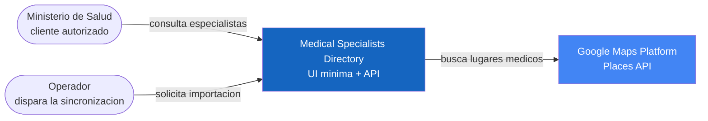
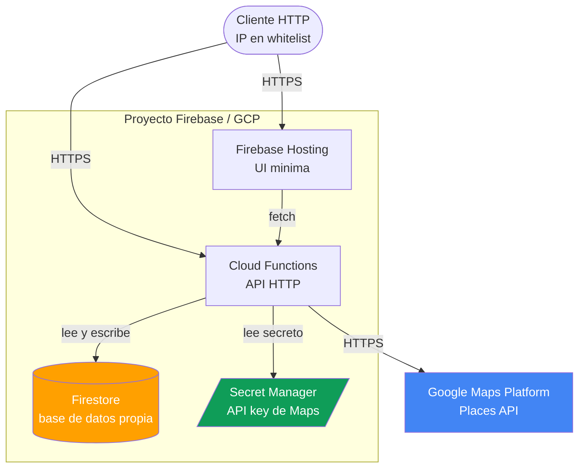
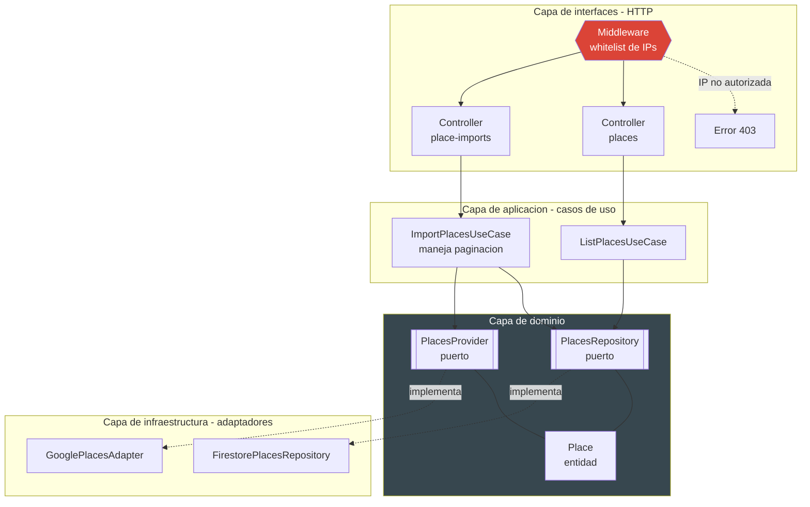
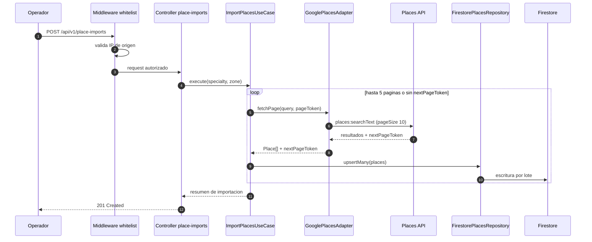
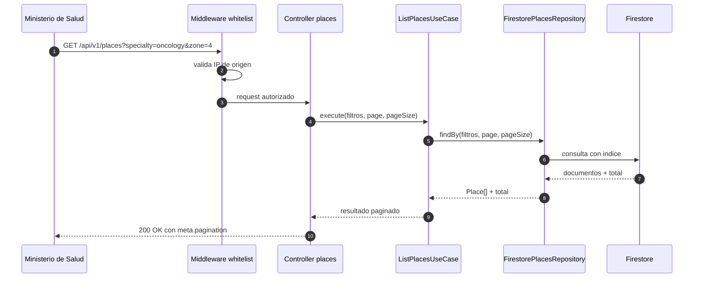
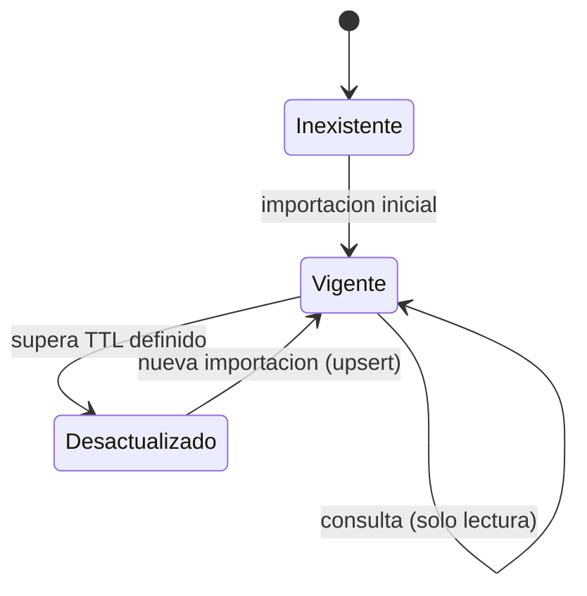
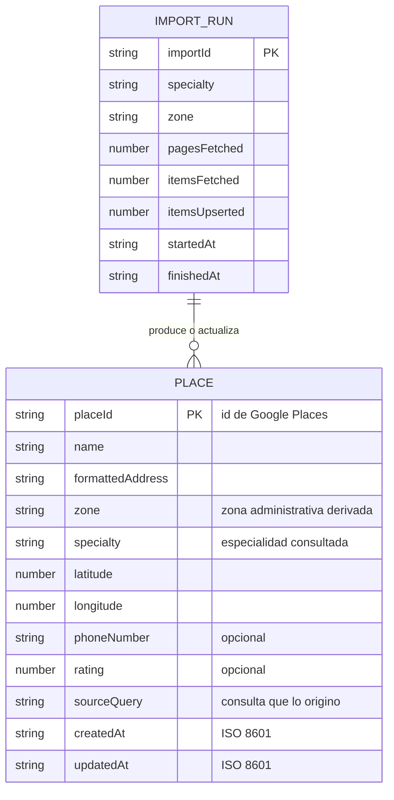

# Diseño del sistema: Medical Specialists Directory

Documento de diseño del proyecto. Define el problema, los requisitos, la arquitectura, los contratos de API, el modelo de datos y las decisiones tomadas. La descripción general del repositorio está en [README.md](../README.md).

## Problema y objetivo

El Ministerio de Salud necesita responder consultas del tipo "cuántos oncólogos hay en la zona 4 de la capital" y conservar esa información para uso posterior.

El sistema debe:

- Obtener información de especialistas y centros médicos desde Google Maps Platform (Places API).
- Persistir esa información en una base de datos propia que funcione como caché consultable.
- Exponer una API HTTP que el Ministerio consuma sin depender de Google en tiempo de consulta.
- Restringir el acceso al servicio a un conjunto de IPs autorizadas.
- Ofrecer una UI mínima de consulta.

## Alcance

| Dentro del alcance | Fuera del alcance |
| :--- | :--- |
| API de sincronización contra Places API con paginación | Autenticación de usuarios finales |
| API de consulta sobre base de datos propia | Frontend elaborado o diseño visual |
| Whitelist de IPs como control de acceso | Georreferenciación avanzada o rutas |
| Persistencia en Firestore como caché | Multi-tenant o múltiples ministerios |
| UI mínima de consulta | Analítica o reportería |

## Requisitos

### Funcionales

| ID | Requisito |
| :--- | :--- |
| RF-01 | Consultar lugares médicos en Places API filtrando por especialidad y zona geográfica |
| RF-02 | Recorrer los resultados paginados de Places API hasta un máximo de 50 registros, en páginas de 10 |
| RF-03 | Persistir los resultados en la base de datos propia sin duplicar registros existentes |
| RF-04 | Exponer un endpoint de consulta que lea únicamente de la base de datos propia |
| RF-05 | Paginar la respuesta del endpoint de consulta |
| RF-06 | Proveer una UI mínima que consuma el endpoint de consulta |

### No funcionales

| ID | Requisito |
| :--- | :--- |
| RNF-01 | Solo IPs en whitelist pueden consumir el servicio; el resto recibe `403` |
| RNF-02 | La API key de Google nunca se versiona ni se expone al cliente; se lee de Secret Manager o variables de entorno |
| RNF-03 | La lógica de negocio no depende de Firestore ni de Google Places (arquitectura limpia) |
| RNF-04 | Todo el tráfico va sobre HTTPS |
| RNF-05 | El consumo contra Places API se acota por la paginación de RF-02 para controlar costo |

## Stack

| Componente | Tecnología |
| :--- | :--- |
| Lenguaje | TypeScript |
| Backend | Firebase Cloud Functions |
| Base de datos | Firestore |
| Hosting de UI | Firebase Hosting |
| Fuente de datos | Google Maps Platform, Places API |
| Secretos | Secret Manager / variables de entorno |
| Gestor de paquetes | pnpm |

## Arquitectura

El diseño combina dos decisiones:

- **Cliente-servicio**: la UI nunca accede directamente a Firestore ni a Google Maps. Todo pasa por las Firebase Functions, único componente que conoce esos detalles y que expone una API HTTP. El cliente consume contratos, no implementación.
- **Arquitectura limpia** dentro del servicio: la lógica de negocio no depende de detalles de infraestructura. Las capas son interfaces (HTTP), aplicación (casos de uso), dominio (puertos) e infraestructura (adaptadores).

### Diagrama 1: contexto

Actores y sistemas externos con los que interactúa la solución.



### Diagrama 2: contenedores y despliegue

Piezas desplegables y dónde vive cada una.



### Diagrama 3: capas y componentes

Estructura interna del servicio bajo arquitectura limpia. Las dependencias apuntan siempre hacia el dominio.



Responsabilidad de cada capa:

| Capa | Responsabilidad | Qué nunca hace |
| :--- | :--- | :--- |
| Interfaces | Traducir HTTP a llamada de caso de uso, validar entrada, aplicar whitelist | Decidir reglas de negocio |
| Aplicación | Orquestar paginación, decidir qué se guarda y qué se considera desactualizado | Conocer Firestore o Google Places |
| Dominio | Definir la entidad `Place` y los puertos `PlacesRepository` y `PlacesProvider` | Depender de librerías externas |
| Infraestructura | Saber *cómo* hablar con Firestore y con Places API | Decidir *cuándo* o *por qué* se llama |

### Diagrama 4: flujo del middleware de whitelist

Control de acceso previo a cualquier controlador.


La IP autorizada es la IP pública de salida del cliente y cambia según la red desde la que se conecta, por lo que se administra como configuración y no como valor fijo en código.

### Diagrama 5: secuencia de importación con paginación

Único flujo que llama a Google. Recorre páginas de 10 hasta un máximo de 50 resultados.



Reglas del caso de uso:

- Tamaño de página fijo en 10 y tope global de 50 resultados por importación.
- El corte ocurre cuando se alcanza el tope o cuando Places API deja de devolver `nextPageToken`.
- La escritura es idempotente: se hace *upsert* por `placeId`, de modo que repetir una importación no duplica registros.

### Diagrama 6: secuencia de consulta

Flujo que consume el Ministerio. No toca Google en ningún momento.



### Diagrama 7: ciclo de vida del dato en caché



La consulta nunca dispara una llamada a Google. La actualización es explícita y ocurre solo mediante una importación.

## Modelo de datos

Colección `places` en Firestore, con `placeId` de Google como identificador del documento.



Índices requeridos en Firestore:

- Compuesto sobre `specialty` y `zone` para el filtro principal.
- Simple sobre `updatedAt` para detectar registros desactualizados.

## Contratos de API

Base: `/api/v1`. Respuestas en JSON con propiedades en camelCase, sobre HTTPS.

### `POST /api/v1/place-imports`

Dispara una importación desde Places API hacia la base propia.

Request:

```json
{
  "specialty": "oncology",
  "zone": "4",
  "city": "Guatemala"
}
```

Respuesta `201 Created`:

```json
{
  "code": "place_import_created",
  "message": "Place import completed successfully",
  "data": {
    "importId": "imp_001",
    "specialty": "oncology",
    "zone": "4",
    "pagesFetched": 5,
    "itemsFetched": 50,
    "itemsUpserted": 47
  }
}
```

### `GET /api/v1/places`

Consulta la base propia. No llama a Google.

Query params:

| Parámetro | Tipo | Descripción |
| :--- | :--- | :--- |
| `specialty` | string | Especialidad médica a filtrar |
| `zone` | string | Zona administrativa |
| `q` | string | Búsqueda de texto libre sobre el nombre |
| `page` | number | Página actual, por defecto 1 |
| `pageSize` | number | Tamaño de página, por defecto 10 |

Respuesta `200 OK`:

```json
{
  "code": "place_list",
  "message": "Resources list retrieved successfully",
  "data": [
    {
      "placeId": "ChIJ_example_1",
      "name": "Centro Oncologico Zona 4",
      "formattedAddress": "4a Avenida 12-34 Zona 4, Guatemala",
      "specialty": "oncology",
      "zone": "4",
      "latitude": 14.6182,
      "longitude": -90.5129
    }
  ],
  "meta": {
    "pagination": {
      "page": 1,
      "pageSize": 10,
      "totalItems": 47,
      "totalPages": 5
    }
  }
}
```

### Errores

| Código HTTP | `code` | Cuándo ocurre |
| :--- | :--- | :--- |
| `400` | `validation_error` | Parámetros ausentes o mal formados |
| `403` | `ip_not_allowed` | IP de origen fuera de la whitelist |
| `422` | `unsupported_specialty` | Especialidad no soportada por el catálogo |
| `503` | `places_provider_unavailable` | Places API no responde o agota cuota |

Formato de error:

```json
{
  "code": "ip_not_allowed",
  "message": "Request origin is not allowed"
}
```

Ningún mensaje de error expone nombres de colecciones, la API key ni trazas internas.

## Seguridad

| Control | Implementación |
| :--- | :--- |
| Acceso al servicio | Whitelist de IPs aplicada en middleware antes de cualquier controlador |
| API key de Google | Leída de Secret Manager o variables de entorno; nunca versionada ni enviada al cliente |
| Transporte | HTTPS obligatorio |
| Superficie expuesta | La UI solo conoce `GET /api/v1/places`; la importación no es pública |
| Costo | Tope de 50 resultados por importación y páginas de 10 para acotar llamadas facturables |
| Validación | Todo parámetro de entrada se valida antes de llegar al caso de uso |

Cada integrante del equipo usa su propia API key en desarrollo. Compartir una key multiplica el riesgo de consumo no controlado sobre una sola cuenta.

## Decisiones de diseño

| Decisión | Alternativa descartada | Razón |
| :--- | :--- | :--- |
| Dos endpoints separados: importación y consulta | Un endpoint que consulte Google en cada request | Aísla el costo y la latencia de Google del flujo de consulta y permite servir desde caché |
| Firestore como caché persistente | Caché en memoria de la función | Las Cloud Functions son efímeras; la información debe sobrevivir entre invocaciones |
| Puertos e implementaciones separadas | Llamar al SDK de Firestore desde el caso de uso | Permite sustituir base de datos o proveedor sin tocar la lógica de negocio |
| Whitelist en código además de configuración en GCP | Solo configuración en la consola de GCP | Deja el control versionado y auditable junto al resto del sistema |
| Upsert por `placeId` | Insertar siempre | Hace la importación idempotente y evita duplicados |

## Riesgos y mitigaciones

Se aplica el ciclo mapear, medir y manejar.

| Riesgo | Métrica | Mitigación |
| :--- | :--- | :--- |
| Cobertura desigual entre zonas: Places API tiene menos registros en áreas rurales | Registros por zona respecto al total | Documentar la cobertura por zona y no presentar la base como censo completo |
| Sesgo de despliegue: el sistema se prueba con datos inventados y falla con datos reales | Diferencia entre resultados en pruebas y en producción | Probar la importación contra Places API real antes de entregar |
| Datos desactualizados servidos como vigentes | Antigüedad de `updatedAt` por documento | TTL explícito y campo `updatedAt` visible en la respuesta |
| Fuga o abuso de la API key | Llamadas facturadas por día | Secret Manager, key por integrante y tope de resultados por importación |
| Exposición innecesaria de datos | Campos devueltos por endpoint | La respuesta incluye solo los campos que la UI utiliza |

## Consideraciones éticas del proyecto

- **Términos de servicio de Google**: los TOS restringen exponer una API que devuelva exactamente lo mismo que devuelve Google. El sistema se limita a un uso académico y almacena un subconjunto acotado de campos para responder consultas del Ministerio, no para replicar el servicio.
- **Datos de salud**: aunque los registros provienen de fuentes públicas de negocios, el dominio es sanitario. No se almacena información de pacientes ni datos personales sensibles.
- **Transparencia del resultado**: la respuesta expone `updatedAt` y la paginación para que quien consulte sepa qué tan reciente y qué tan completo es lo que está viendo, en lugar de interpretar la lista como exhaustiva.
- **Minimización**: solo se persisten los campos necesarios para localizar un especialista.

## Referencias

- [Google Maps Platform, Places API](https://developers.google.com/maps/documentation/places/web-service/overview)
- [Firebase Cloud Functions](https://firebase.google.com/docs/functions)
- [Firestore](https://firebase.google.com/docs/firestore)
- [pnpm](https://pnpm.io/)
- [Clean Architecture, Robert C. Martin](https://blog.cleancoder.com/uncle-bob/2012/08/13/the-clean-architecture.html)
